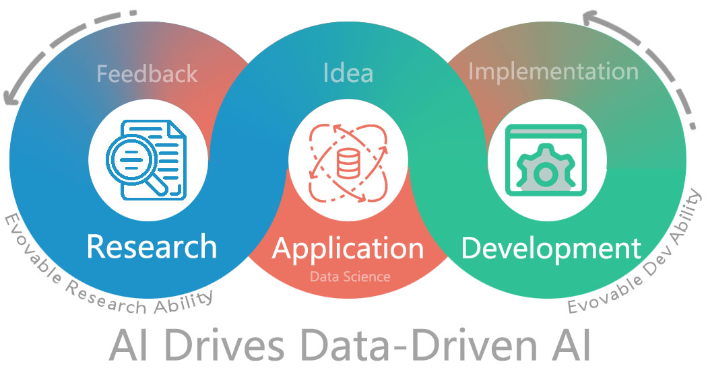

TODO: Add badges.

# 📰 News
| 🗞️News        | 📝Description                 |
| --            | ------                        |
| First release | RDAgent are release on Github |


# 🌟 Introduction



RDAgent aims to automate the most critical and valuable aspects of the industrial R&D process, and we begins with focusing on the data-driven scenarios to streamline the development of models and data. 
Methodologically, we have identified a framework with two key components: 'R' for proposing new ideas and 'D' for implementing them.
We believe that the automatic evolution of R&D will lead to solutions of significant industrial value.


<!-- Tag Cloud -->
R&D is a very general scenario. The advent of RDAgent can be your
- [🎥Automatic Quant Factory]()
- 🤖Data mining agent: iteratively proposing [🎥data]() & [models]() and implementing them by gaining knowledge from data.
- 🦾Research copilot: Auto read [🎥research papers]()/[🎥reports]() and implement model structures or building datasets.
- ...

You can click the [🎥link]() above to view the demo. More methods and scenarios are being added to the project to empower your R&D processes and boost productivity.

We have a quick 🎥demo for one use case of RDAgent.
- TODO: Demo


# ⚡Quick start
You can try our demo by running the following command:

### 🐍 Create a Conda Environment
- Create a new conda environment with Python (3.10 and 3.11 are well tested in our CI):
  ```sh
  conda create -n rdagent python=3.10
  ```
- Activate the environment:
  ```sh
  conda activate rdagent
  ```

### 🛠️ Run Make Files
TODO: `pip install rdagent` in the future.

- **Navigate to the directory containing the MakeFile** and set up the development environment:
  ```sh
  make dev
  ```

### 📦 Install Pytorch
TODO: use docker in quick start intead.

- Install Pytorch and related libraries:
  ```sh
  pip3 install torch torchvision torchaudio --index-url https://download.pytorch.org/whl/cpu
  pip3 install torch_geometric
  ```

### ⚙️ Environment Configuration
- Place the `.env` file in the same directory as the `.env.example` file.
  - The `.env.example` file contains the environment variables required for users using the OpenAI API (Please note that `.env.example` is an example file. `.env` is the one that will be finally used.)
  - please refer to [Configuration](docs/build/html/installation.html#azure-openai) for the detailed explanation of the `.env`
- Export each variable in the `.env` file:
  ```sh
  export $(grep -v '^#' .env | xargs)
  ```
### 🚀 Run the Application
TODO: run the front-page demo.

The [🎥demo]() is implemented by the above commands.

- Run the factor extraction and implementation application based on financial reports:
  ```sh
  python rdagent/app/qlib_rd_loop/factor_from_report_sh.py
  ```

- Run the self-loop factor extraction and implementation application:
  ```sh
  python rdagent/app/qlib_rd_loop/factor.py
  ```

- Run the self-loop model extraction and implementation application:
  ```sh
  python rdagent/app/qlib_rd_loop/model.py
  ```


# Scenarios

We have applied RD-Agent to multiple valuable data-driven industrial scenarios..


## 🎯 Goal: Agent for Data-driven R&D

In this project, we are aiming to build a Agent to automate Data-Driven R\&D that can
+ 📄Read real-world material (reports, papers, etc.) and **extract** key formulas, descriptions of interested **features** and **models**, which are the key components of data-driven R&D .
+ 🛠️**Implement** the extracted formulas (e.g., features, factors, and models) in runnable codes.
   + Due to the limited ability of LLM in implementing at once, evolve the agent to be able to extend abilities by learning from feedback and knowledge and improve the agent's ability to implement more complex models.
+ 💡Propose **new ideas** based on current knowledge and observations.

<!--  -->

## 📈 Scenarios/Demos

In the two key areas of data-driven scenarios, model implementation and data building, our system aims to serve two main roles: 🦾copilot and 🤖agent. The 🦾copilot follows human instructions to automate repetitive tasks. The 🤖agent, being more autonomous, actively proposes ideas for better results in the future.

The supported scenarios are listed below:

| Scenario/Target | Model Implementation                   | Data Building                                                                      |
| --              | --                                     | --                                                                                 |
| 💹 Finance      | 🤖Iteratively Proposing Ideas & Evolving | - 🦾Auto reports reading & implementation <br/> - 🤖Iteratively Proposing Ideas & Evolving |
| 🩺 Medical      | 🤖Iteratively Proposing Ideas & Evolving | -                                                                                  |
| 🏭 General      | 🦾Auto paper reading & implementation    | -                                                                                  |

Different scenarios vary in entrance and configuration. Please check the detailed setup tutorial in the scenarios documents.

TODO: Scenario Gallary
- map(scenario) => knowledge list;

# ⚙️Framework


Automating the R&D process in data science is a highly valuable yet underexplored area in industry. We propose a framework to push the boundaries of this important research field.

The research questions within this framework can be divided into three main categories:
| Research Area | Paper/Work List |
|--------------------|-----------------|
| Benchmark the R&D abilities | [Benchmark](#benchmark) |
| Idea proposal: Explore new ideas or refine existing ones | [Research](#research) |
| Ability to realize ideas: Implement and execute ideas | [Development](#development) |

We believe that the key to delivering high-quality solutions lies in the ability to evolve R&D capabilities. Agents should learn like human experts, continuously improving their R&D skills.


# 📃Paper/Work list

## Benchmark
- [Towards Data-Centric Automatic R&D](https://arxiv.org/abs/2404.11276);
```BibTeX
@misc{chen2024datacentric,
    title={Towards Data-Centric Automatic R&D},
    author={Haotian Chen and Xinjie Shen and Zeqi Ye and Wenjun Feng and Haoxue Wang and Xiao Yang and Xu Yang and Weiqing Liu and Jiang Bian},
    year={2024},
    eprint={2404.11276},
    archivePrefix={arXiv},
    primaryClass={cs.AI}
}
```


## Research

- We have implements agents equiped with  Evolvable Research ability to propose and refine ideas in our repo. [Demos](#📈 Scenarios/Demos) are released.

## Development

- [Collaborative Evolving Strategy for Automatic Data-Centric Development](https://arxiv.org/abs/2407.18690)
```BibTeX
@misc{yang2024collaborative,
    title={Collaborative Evolving Strategy for Automatic Data-Centric Development},
    author={Xu Yang and Haotian Chen and Wenjun Feng and Haoxue Wang and Zeqi Ye and Xinjie Shen and Xiao Yang and Shizhao Sun and Weiqing Liu and Jiang Bian},
    year={2024},
    eprint={2407.18690},
    archivePrefix={arXiv},
    primaryClass={cs.AI}
}
```


# Contributing

More documents can be found in the [📚readthedocs](). TODO: add link

## Guidance
This project welcomes contributions and suggestions.
You can find issues in the issues list or simply running `grep -r "TODO:"`.

Making contributions is not a hard thing. Solving an issue(maybe just answering a question raised in issues list ), fixing/issuing a bug, improving the documents and even fixing a typo are important contributions to RDAgent.

# Disclaimer
**The RD-agent is provided “as is”, without warranty of any kind, express or implied, including but not limited to the warranties of merchantability, fitness for a particular purpose and noninfringement. The RD-agent is aimed to facilitate research and development process in the financial industry and not ready-to-use for any financial investment or advice. Users shall independently assess and test the risks of the RD-agent in a specific use scenario, ensure the responsible use of AI technology, including but not limited to developing and integrating risk mitigation measures, and comply with all applicable laws and regulations in all applicable jurisdictions. The RD-agent does not provide financial opinions or reflect the opinions of Microsoft, nor is it designed to replace the role of qualified financial professionals in formulating, assessing, and approving finance products. The inputs and outputs of the RD-agent belong to the users and users shall assume all liability under any theory of liability, whether in contract, torts, regulatory, negligence, products liability, or otherwise, associated with use of the RD-agent and any inputs and outputs thereof.**


<a href="https://github.com/microsoft/RD-Agent/graphs/contributors"></a>

