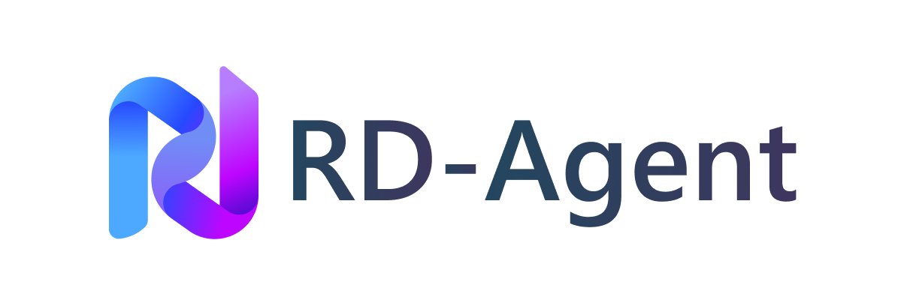
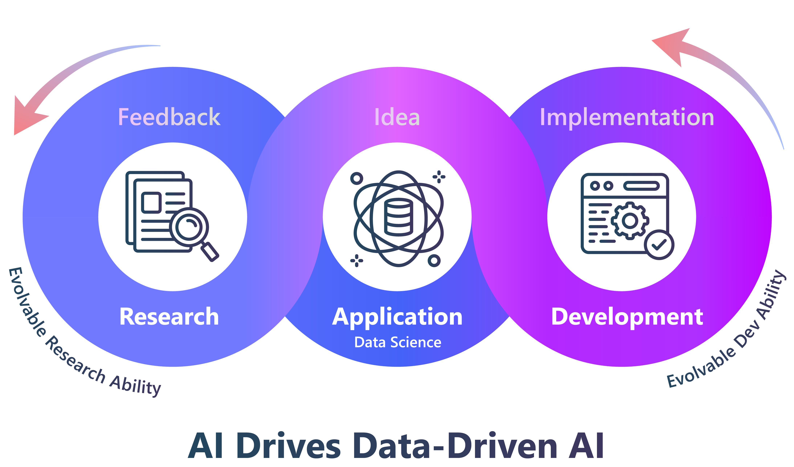
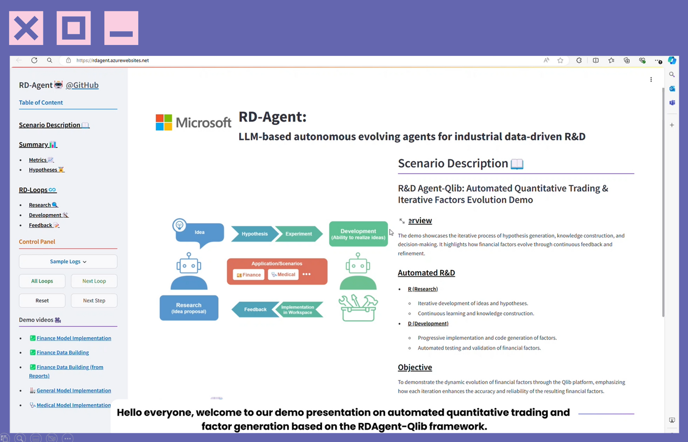
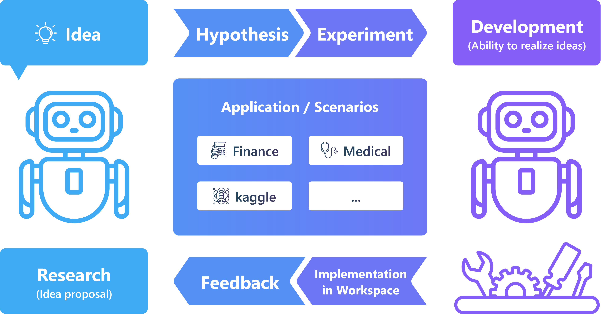

<h4 align="center">
  
  
  <a href="https://rdagent.azurewebsites.net" target="_blank">🖥️ Live Demo</a> |
  <a href="https://rdagent.azurewebsites.net/factor_loop" target="_blank">🎥 Demo Video</a> <a href="https://www.youtube.com/watch?v=JJ4JYO3HscM&list=PLALmKB0_N3_i52fhUmPQiL4jsO354uopR" target="_blank">▶️YouTube</a>   |
  <a href="https://rdagent.readthedocs.io/en/latest/index.html" target="_blank">📖 Documentation</a> |
  <a href="https://aka.ms/RD-Agent-Tech-Report" target="_blank">📄 Tech Report</a> |
  <a href="#-paperwork-list"> 📃 Papers </a>
</h3>


[](https://github.com/microsoft/RD-Agent/actions/workflows/ci.yml)
[](https://github.com/microsoft/RD-Agent/actions/workflows/github-code-scanning/codeql)
[](https://github.com/microsoft/RD-Agent/actions/workflows/dependabot/dependabot-updates)
[](https://github.com/microsoft/RD-Agent/actions/workflows/pr.yml)
[](https://github.com/microsoft/RD-Agent/actions/workflows/release.yml)
[](https://pypi.org/project/rdagent/#files)
[](https://pypi.org/project/rdagent/)
[](https://pypi.org/project/rdagent/)
[](https://github.com/microsoft/RD-Agent/releases)
[](https://github.com/microsoft/RD-Agent/blob/main/LICENSE)
[](https://github.com/pre-commit/pre-commit)
[](http://mypy-lang.org/)
[](https://github.com/astral-sh/ruff)
[](https://discord.gg/ybQ97B6Jjy)
[](https://rdagent.readthedocs.io/en/latest/?badge=latest)
[](https://github.com/microsoft/RD-Agent/actions/workflows/readthedocs-preview.yml) <!-- this badge is too long, please place it in the last one to make it pretty --> 
[](https://arxiv.org/abs/2505.14738)


# 🏆 The Best Machine Learning Engineering Agent!

[MLE-bench](https://github.com/openai/mle-bench) is a comprehensive benchmark evaluating the performance of AI agents on machine learning engineering tasks. Utilizing datasets from 75 Kaggle competitions, MLE-bench provides robust assessments of AI systems' capabilities in real-world ML engineering scenarios.

R&D-Agent currently leads as the top-performing machine learning engineering agent on MLE-bench:

| Agent | Low == Lite (%) | Medium (%) | High (%) | All (%) |
|---------|--------|-----------|---------|----------|
| R&D-Agent o1-preview | 48.18 ± 2.49 | 8.95 ± 2.36 | 18.67 ± 2.98 | 22.4 ± 1.1 |
| R&D-Agent o3(R)+GPT-4.1(D) | 51.52 ± 6.21 | 7.89 ± 3.33 | 16.67 ± 3.65 | 22.45 ± 2.45 |
| AIDE o1-preview | 34.3 ± 2.4 | 8.8 ± 1.1 | 10.0 ± 1.9 | 16.9 ± 1.1 |

**Notes:**
- **O3(R)+GPT-4.1(D)**: This version is designed to both reduce average time per loop and leverage a cost-effective combination of backend LLMs by seamlessly integrating Research Agent (o3) with Development Agent (GPT-4.1).
- **AIDE o1-preview**: Represents the previously best public result on MLE-bench as reported in the original MLE-bench paper.
- Average and standard deviation results for R&D-Agent o1-preview is based on a independent of 5 seeds and for R&D-Agent o3(R)+GPT-4.1(D) is based on 6 seeds.
- According to MLE-Bench, the 75 competitions are categorized into three levels of complexity: **Low==Lite** if we estimate that an experienced ML engineer can produce a sensible solution in under 2 hours, excluding the time taken to train any models; **Medium** if it takes between 2 and 10 hours; and **High** if it takes more than 10 hours.

You can inspect the detailed runs of the above results online.
- [R&D-Agent o1-preview detailed runs](https://aka.ms/RD-Agent_MLE-Bench_O1-preview)
- [R&D-Agent o3(R)+GPT-4.1(D) detailed runs](https://aka.ms/RD-Agent_MLE-Bench_O3_GPT41)

For running R&D-Agent on MLE-bench, refer to **[MLE-bench Guide: Running ML Engineering via MLE-bench](https://rdagent.readthedocs.io/en/latest/scens/data_science.html)**

# 🥇 The First Data-Centric Quant Multi-Agent Framework!

R&D-Agent for Quantitative Finance, in short **RD-Agent(Q)**, is the first data-centric, multi-agent framework designed to automate the full-stack research and development of quantitative strategies via coordinated factor-model co-optimization.


Extensive experiments in real stock markets show that, at a cost under $10, RD-Agent(Q) achieves approximately 2× higher ARR than benchmark factor libraries while using over 70% fewer factors. It also surpasses state-of-the-art deep time-series models under smaller resource budgets. Its alternating factor–model optimization further delivers excellent trade-off between predictive accuracy and strategy robustness.

You can learn more details about **RD-Agent(Q)** through the [paper](https://arxiv.org/abs/2505.15155) and reproduce it through the [documentation](https://rdagent.readthedocs.io/en/latest/scens/quant_agent_fin.html).

# 📰 News
| 🗞️ News        | 📝 Description                 |
| --            | ------      |
| [Technical Report Release](#overall-technical-report) | Overall framework description and results on MLE-bench | 
| [R&D-Agent-Quant Release](#deep-application-in-diverse-scenarios) | Apply R&D-Agent to quant trading | 
| MLE-Bench Results Released | R&D-Agent currently leads as the [top-performing machine learning engineering agent](#-the-best-machine-learning-engineering-agent) on MLE-bench |
| Support LiteLLM Backend | We now fully support **[LiteLLM](https://github.com/BerriAI/litellm)** as our default backend for integration with multiple LLM providers. |
| General Data Science Agent | [Data Science Agent](https://rdagent.readthedocs.io/en/latest/scens/data_science.html) |
| Kaggle Scenario release | We release **[Kaggle Agent](https://rdagent.readthedocs.io/en/latest/scens/data_science.html)**, try the new features!                  |
| Official WeChat group release  | We created a WeChat group, welcome to join! (🗪[QR Code](https://github.com/microsoft/RD-Agent/issues/880)) |
| Official Discord release  | We launch our first chatting channel in Discord (🗪[](https://discord.gg/ybQ97B6Jjy)) |
| First release | **R&D-Agent** is released on GitHub |


# Data Science Agent Preview
Check out our demo video showcasing the current progress of our Data Science Agent under development:

https://github.com/user-attachments/assets/3eccbecb-34a4-4c81-bce4-d3f8862f7305

# 🌟 Introduction
<div align="center">
      
</div>

R&D-Agent aims to automate the most critical and valuable aspects of the industrial R&D process, and we begin with focusing on the data-driven scenarios to streamline the development of models and data. 
Methodologically, we have identified a framework with two key components: 'R' for proposing new ideas and 'D' for implementing them.
We believe that the automatic evolution of R&D will lead to solutions of significant industrial value.


<!-- Tag Cloud -->
R&D is a very general scenario. The advent of R&D-Agent can be your
- 💰 **Automatic Quant Factory** ([🎥Demo Video](https://rdagent.azurewebsites.net/factor_loop)|[▶️YouTube](https://www.youtube.com/watch?v=X4DK2QZKaKY&t=6s))
- 🤖 **Data Mining Agent:** Iteratively proposing data & models ([🎥Demo Video 1](https://rdagent.azurewebsites.net/model_loop)|[▶️YouTube](https://www.youtube.com/watch?v=dm0dWL49Bc0&t=104s)) ([🎥Demo Video 2](https://rdagent.azurewebsites.net/dmm)|[▶️YouTube](https://www.youtube.com/watch?v=VIaSTZuoZg4))  and implementing them by gaining knowledge from data.
- 🦾 **Research Copilot:** Auto read research papers ([🎥Demo Video](https://rdagent.azurewebsites.net/report_model)|[▶️YouTube](https://www.youtube.com/watch?v=BiA2SfdKQ7o)) / financial reports ([🎥Demo Video](https://rdagent.azurewebsites.net/report_factor)|[▶️YouTube](https://www.youtube.com/watch?v=ECLTXVcSx-c)) and implement model structures or building datasets.
- 🤖 **Kaggle Agent:** Auto Model Tuning and Feature Engineering([🎥Demo Video Coming Soon...]()) and implementing them to achieve more in competitions.
- ...

You can click the links above to view the demo. We're continuously adding more methods and scenarios to the project to enhance your R&D processes and boost productivity. 

Additionally, you can take a closer look at the examples in our **[🖥️ Live Demo](https://rdagent.azurewebsites.net/)**.

<div align="center">
    <a href="https://rdagent.azurewebsites.net/" target="_blank">
        
    </a>
</div>


# ⚡ Quick start

You can try above demos by running the following command:

### 🐳 Docker installation.
Users must ensure Docker is installed before attempting most scenarios. Please refer to the [official 🐳Docker page](https://docs.docker.com/engine/install/) for installation instructions.
Ensure the current user can run Docker commands **without using sudo**. You can verify this by executing `docker run hello-world`.

### 🐍 Create a Conda Environment
- Create a new conda environment with Python (3.10 and 3.11 are well-tested in our CI):
  ```sh
  conda create -n rdagent python=3.10
  ```
- Activate the environment:
  ```sh
  conda activate rdagent
  ```

### 🛠️ Install the R&D-Agent

#### For Users
- You can directly install the R&D-Agent package from PyPI:
  ```sh
  pip install rdagent
  ```

#### For Developers
- If you want to try the latest version or contribute to RD-Agent, you can install it from the source and follow the development setup:
  ```sh
  git clone https://github.com/microsoft/RD-Agent
  cd RD-Agent
  make dev
  ```

More details can be found in the [development setup](https://rdagent.readthedocs.io/en/latest/development.html).

### 💊 Health check
- rdagent provides a health check that currently checks two things.
  - whether the docker installation was successful.
  - whether the default port used by the [rdagent ui](https://github.com/microsoft/RD-Agent?tab=readme-ov-file#%EF%B8%8F-monitor-the-application-results) is occupied.
  ```sh
  rdagent health_check
  ```


### ⚙️ Configuration
- The demos requires following ability:
  - ChatCompletion
  - json_mode
  - embedding query

  You can set your Chat Model and Embedding Model in the following ways:

  > **🔥 Attention**: We now provide experimental support for **DeepSeek** models! You can use DeepSeek's official API for cost-effective and high-performance inference. See the configuration example below for DeepSeek setup.

- **Using LiteLLM (Default)**: We now support LiteLLM as a backend for integration with multiple LLM providers. You can configure in multiple ways:

  **Option 1: Unified API base for both models**
  ```bash
  cat << EOF  > .env
  # Set to any model supported by LiteLLM.
  CHAT_MODEL=gpt-4o 
  EMBEDDING_MODEL=text-embedding-3-small
  # Configure unified API base
  OPENAI_API_BASE=<your_unified_api_base>
  OPENAI_API_KEY=<replace_with_your_openai_api_key>
  ```

  **Option 2: Separate API bases for Chat and Embedding models**
  ```bash
  cat << EOF  > .env
  # Set to any model supported by LiteLLM.
  # Configure separate API bases for chat and embedding
  
  # CHAT MODEL:
  CHAT_MODEL=gpt-4o 
  OPENAI_API_BASE=<your_chat_api_base>
  OPENAI_API_KEY=<replace_with_your_openai_api_key>

  # EMBEDDING MODEL:
  # TAKE siliconflow as an example, you can use other providers.
  # Note: embedding requires litellm_proxy prefix
  EMBEDDING_MODEL=litellm_proxy/BAAI/bge-large-en-v1.5
  LITELLM_PROXY_API_KEY=<replace_with_your_siliconflow_api_key>
  LITELLM_PROXY_API_BASE=https://api.siliconflow.cn/v1
  ```

  **Configuration Example: DeepSeek Setup**:

  >Since many users encounter configuration errors when setting up DeepSeek. Here's a complete working example for DeepSeek Setup:
  ```bash
  cat << EOF  > .env
  # CHAT MODEL: Using DeepSeek Official API
  CHAT_MODEL=deepseek/deepseek-chat 
  DEEPSEEK_API_KEY=<replace_with_your_deepseek_api_key>

  # EMBEDDING MODEL: Using SiliconFlow for embedding since deepseek has no embedding model.
  # Note: embedding requires litellm_proxy prefix
  EMBEDDING_MODEL=litellm_proxy/BAAI/bge-m3
  LITELLM_PROXY_API_KEY=<replace_with_your_siliconflow_api_key>
  LITELLM_PROXY_API_BASE=https://api.siliconflow.cn/v1
  ```

  Notice: If you are using reasoning models that include thought processes in their responses (such as \<think> tags), you need to set the following environment variable:
  ```bash
  REASONING_THINK_RM=True
  ```

- You can also use a deprecated backend if you only use `OpenAI API` or `Azure OpenAI` directly. For this deprecated setting and more configuration information, please refer to the [documentation](https://rdagent.readthedocs.io/en/latest/installation_and_configuration.html).

### 🚀 Run the Application

The **[🖥️ Live Demo](https://rdagent.azurewebsites.net/)** is implemented by the following commands(each item represents one demo, you can select the one you prefer):

- Run the **Automated Quantitative Trading & Iterative Factors Model Joint Evolution**:  [Qlib](http://github.com/microsoft/qlib) self-loop factor & model proposal and implementation application
  ```sh
  rdagent fin_quant
  ```

- Run the **Automated Quantitative Trading & Iterative Factors Evolution**:  [Qlib](http://github.com/microsoft/qlib) self-loop factor proposal and implementation application
  ```sh
  rdagent fin_factor
  ```

- Run the **Automated Quantitative Trading & Iterative Model Evolution**: [Qlib](http://github.com/microsoft/qlib) self-loop model proposal and implementation application
  ```sh
  rdagent fin_model
  ```

- Run the **Automated Quantitative Trading & Factors Extraction from Financial Reports**:  Run the [Qlib](http://github.com/microsoft/qlib) factor extraction and implementation application based on financial reports
  ```sh
  # 1. Generally, you can run this scenario using the following command:
  rdagent fin_factor_report --report_folder=<Your financial reports folder path>

  # 2. Specifically, you need to prepare some financial reports first. You can follow this concrete example:
  wget https://github.com/SunsetWolf/rdagent_resource/releases/download/reports/all_reports.zip
  unzip all_reports.zip -d git_ignore_folder/reports
  rdagent fin_factor_report --report_folder=git_ignore_folder/reports
  ```

- Run the **Automated Model Research & Development Copilot**: model extraction and implementation application
  ```sh
  # 1. Generally, you can run your own papers/reports with the following command:
  rdagent general_model <Your paper URL>

  # 2. Specifically, you can do it like this. For more details and additional paper examples, use `rdagent general_model -h`:
  rdagent general_model  "https://arxiv.org/pdf/2210.09789"
  ```

- Run the **Automated Kaggle Model Tuning & Feature Engineering**:  self-loop model proposal and feature engineering implementation application <br />
  > Using **sf-crime** *(San Francisco Crime Classification)* as an example. <br />
  > 1. Register and login on the [Kaggle](https://www.kaggle.com/) website. <br />
  > 2. Configuring the Kaggle API. <br />
  > (1) Click on the avatar (usually in the top right corner of the page) -> `Settings` -> `Create New Token`, A file called `kaggle.json` will be downloaded. <br />
  > (2) Move `kaggle.json` to `~/.config/kaggle/` <br />
  > (3) Modify the permissions of the kaggle.json file. Reference command: `chmod 600 ~/.config/kaggle/kaggle.json` <br />
  > 3. Join the competition: Click `Join the competition` -> `I Understand and Accept` at the bottom of the [competition details page](https://www.kaggle.com/competitions/sf-crime/data).
  ```bash
  # Generally, you can run the Kaggle competition program with the following command:
  rdagent data_science --competition <your competition name>

  # Specifically, you need to create a folder for storing competition files (e.g., competition description file, competition datasets, etc.), and configure the path to the folder in your environment. In addition, you need to use chromedriver when you download the competition descriptors, which you can follow for this specific example:
  
  # 1. Install chromedriver.

  # 2. Add the competition description file path to the `.env` file.
  mkdir -p ./git_ignore_folder/kaggle_data
  dotenv set DS_LOCAL_DATA_PATH "$(pwd)/git_ignore_folder/kaggle_data"
  dotenv set DS_IF_USING_MLE_DATA True

  # 3. run the application
  rdagent data_science --competition sf-crime
  ```

### 🖥️ Monitor the Application Results
- You can run the following command for our demo program to see the run logs.

  ```sh
  rdagent ui --port 19899 --log_dir <your log folder like "log/">
  ```

  **Note:** Although port 19899 is not commonly used, but before you run this demo, you need to check if port 19899 is occupied. If it is, please change it to another port that is not occupied.

  You can check if a port is occupied by running the following command.

  ```sh
  rdagent health_check
  ```

# 🏭 Scenarios

We have applied R&D-Agent to multiple valuable data-driven industrial scenarios.


## 🎯 Goal: Agent for Data-driven R&D

In this project, we are aiming to build an Agent to automate Data-Driven R\&D that can
+ 📄 Read real-world material (reports, papers, etc.) and **extract** key formulas, descriptions of interested **features** and **models**, which are the key components of data-driven R&D .
+ 🛠️ **Implement** the extracted formulas (e.g., features, factors, and models) in runnable codes.
   + Due to the limited ability of LLM in implementing at once, build an evolving process for the agent to improve performance by learning from feedback and knowledge.
+ 💡 Propose **new ideas** based on current knowledge and observations.

<!--  -->

## 📈 Scenarios/Demos

In the two key areas of data-driven scenarios, model implementation and data building, our system aims to serve two main roles: 🦾Copilot and 🤖Agent. 
- The 🦾Copilot follows human instructions to automate repetitive tasks. 
- The 🤖Agent, being more autonomous, actively proposes ideas for better results in the future.

The supported scenarios are listed below:

| Scenario/Target | Model Implementation                   | Data Building                                                                      |
| --              | --                                     | --                                                                                 |
| **💹 Finance**      | 🤖 [Iteratively Proposing Ideas & Evolving](https://rdagent.azurewebsites.net/model_loop)[▶️YouTube](https://www.youtube.com/watch?v=dm0dWL49Bc0&t=104s) |  🤖 [Iteratively Proposing Ideas & Evolving](https://rdagent.azurewebsites.net/factor_loop) [▶️YouTube](https://www.youtube.com/watch?v=X4DK2QZKaKY&t=6s) <br/>   🦾 [Auto reports reading & implementation](https://rdagent.azurewebsites.net/report_factor)[▶️YouTube](https://www.youtube.com/watch?v=ECLTXVcSx-c)  |
| **🩺 Medical**      | 🤖 [Iteratively Proposing Ideas & Evolving](https://rdagent.azurewebsites.net/dmm)[▶️YouTube](https://www.youtube.com/watch?v=VIaSTZuoZg4) | -                                                                                  |
| **🏭 General**      | 🦾 [Auto paper reading & implementation](https://rdagent.azurewebsites.net/report_model)[▶️YouTube](https://www.youtube.com/watch?v=BiA2SfdKQ7o) <br/> 🤖 Auto Kaggle Model Tuning   | 🤖Auto Kaggle feature Engineering |

- **[RoadMap](https://rdagent.readthedocs.io/en/latest/scens/data_science.html#roadmap)**: Currently, we are working hard to add new features to the Kaggle scenario.

Different scenarios vary in entrance and configuration. Please check the detailed setup tutorial in the scenarios documents.

Here is a gallery of [successful explorations](https://github.com/SunsetWolf/rdagent_resource/releases/download/demo_traces/demo_traces.zip) (5 traces showed in **[🖥️ Live Demo](https://rdagent.azurewebsites.net/)**). You can download and view the execution trace using [this command](https://github.com/microsoft/RD-Agent?tab=readme-ov-file#%EF%B8%8F-monitor-the-application-results) from the documentation.

Please refer to **[📖readthedocs_scen](https://rdagent.readthedocs.io/en/latest/scens/catalog.html)** for more details of the scenarios.

# ⚙️ Framework

<div align="center">
    
</div>


Automating the R&D process in data science is a highly valuable yet underexplored area in industry. We propose a framework to push the boundaries of this important research field.

The research questions within this framework can be divided into three main categories:
| Research Area | Paper/Work List |
|--------------------|-----------------|
| **Benchmark the R&D abilities** | [Benchmark](#benchmark) |
| **Idea proposal:** Explore new ideas or refine existing ones | [Research](#research) |
| **Ability to realize ideas:** Implement and execute ideas | [Development](#development) |

We believe that the key to delivering high-quality solutions lies in the ability to evolve R&D capabilities. Agents should learn like human experts, continuously improving their R&D skills.

More documents can be found in the **[📖 readthedocs](https://rdagent.readthedocs.io/)**.

# 📃 Paper/Work list

## Overall Technical Report
- [R&D-Agent: Automating Data-Driven AI Solution Building Through LLM-Powered Automated Research, Development, and Evolution](https://arxiv.org/abs/2505.14738)
```BibTeX
@misc{yang2024rdagent,
    title={R\&D-Agent: Automating Data-Driven AI Solution Building Through LLM-Powered Automated Research, Development, and Evolution},
    author={Xu Yang and Xiao Yang and Shikai Fang and Bowen Xian and Yuante Li and Jian Wang and Minrui Xu and Haoran Pan and Xinpeng Hong and Weiqing Liu and Yelong Shen and Weizhu Chen and Jiang Bian},
    year={2025},
    eprint={2505.14738},
    archivePrefix={arXiv},
    primaryClass={cs.AI},
    url={https://arxiv.org/abs/2505.14738}
}
```


## 📊 Benchmark
- [Towards Data-Centric Automatic R&D](https://arxiv.org/abs/2404.11276)
```BibTeX
@misc{chen2024datacentric,
    title={Towards Data-Centric Automatic R&D},
    author={Haotian Chen and Xinjie Shen and Zeqi Ye and Wenjun Feng and Haoxue Wang and Xiao Yang and Xu Yang and Weiqing Liu and Jiang Bian},
    year={2024},
    eprint={2404.11276},
    archivePrefix={arXiv},
    primaryClass={cs.AI}
}
```


## 🔍 Research

In a data mining expert's daily research and development process, they propose a hypothesis (e.g., a model structure like RNN can capture patterns in time-series data), design experiments (e.g., finance data contains time-series and we can verify the hypothesis in this scenario), implement the experiment as code (e.g., Pytorch model structure), and then execute the code to get feedback (e.g., metrics, loss curve, etc.). The experts learn from the feedback and improve in the next iteration.

Based on the principles above, we have established a basic method framework that continuously proposes hypotheses, verifies them, and gets feedback from the real-world practice. This is the first scientific research automation framework that supports linking with real-world verification.

For more detail, please refer to our **[🖥️ Live Demo page](https://rdagent.azurewebsites.net)**.

## 🛠️ Development

- [Collaborative Evolving Strategy for Automatic Data-Centric Development](https://arxiv.org/abs/2407.18690)
```BibTeX
@misc{yang2024collaborative,
    title={Collaborative Evolving Strategy for Automatic Data-Centric Development},
    author={Xu Yang and Haotian Chen and Wenjun Feng and Haoxue Wang and Zeqi Ye and Xinjie Shen and Xiao Yang and Shizhao Sun and Weiqing Liu and Jiang Bian},
    year={2024},
    eprint={2407.18690},
    archivePrefix={arXiv},
    primaryClass={cs.AI}
}
```


## Deep Application in Diverse Scenarios

- [R&D-Agent-Quant: A Multi-Agent Framework for Data-Centric Factors and Model Joint Optimization](https://arxiv.org/abs/2505.15155)
```BibTeX
@misc{li2025rdagentquant,
    title={R\&D-Agent-Quant: A Multi-Agent Framework for Data-Centric Factors and Model Joint Optimization},
    author={Yuante Li and Xu Yang and Xiao Yang and Minrui Xu and Xisen Wang and Weiqing Liu and Jiang Bian},
    year={2025},
    eprint={2505.15155},
    archivePrefix={arXiv},
    primaryClass={cs.AI}
}
```


# 🤝 Contributing

We welcome contributions and suggestions to improve R&D-Agent. Please refer to the [Contributing Guide](CONTRIBUTING.md) for more details on how to contribute.

Before submitting a pull request, ensure that your code passes the automatic CI checks.

## 📝 Guidelines
This project welcomes contributions and suggestions.
Contributing to this project is straightforward and rewarding. Whether it's solving an issue, addressing a bug, enhancing documentation, or even correcting a typo, every contribution is valuable and helps improve R&D-Agent.

To get started, you can explore the issues list, or search for `TODO:` comments in the codebase by running the command `grep -r "TODO:"`.


<a href="https://github.com/microsoft/RD-Agent/graphs/contributors">
  
</a>

Before we released R&D-Agent as an open-source project on GitHub, it was an internal project within our group. Unfortunately, the internal commit history was not preserved when we removed some confidential code. As a result, some contributions from our group members, including Haotian Chen, Wenjun Feng, Haoxue Wang, Zeqi Ye, Xinjie Shen, and Jinhui Li, were not included in the public commits.

# ⚖️ Legal disclaimer
<p style="line-height: 1; font-style: italic;">The RD-agent is provided “as is”, without warranty of any kind, express or implied, including but not limited to the warranties of merchantability, fitness for a particular purpose and noninfringement. The RD-agent is aimed to facilitate research and development process in the financial industry and not ready-to-use for any financial investment or advice. Users shall independently assess and test the risks of the RD-agent in a specific use scenario, ensure the responsible use of AI technology, including but not limited to developing and integrating risk mitigation measures, and comply with all applicable laws and regulations in all applicable jurisdictions. The RD-agent does not provide financial opinions or reflect the opinions of Microsoft, nor is it designed to replace the role of qualified financial professionals in formulating, assessing, and approving finance products. The inputs and outputs of the RD-agent belong to the users and users shall assume all liability under any theory of liability, whether in contract, torts, regulatory, negligence, products liability, or otherwise, associated with use of the RD-agent and any inputs and outputs thereof.</p>
