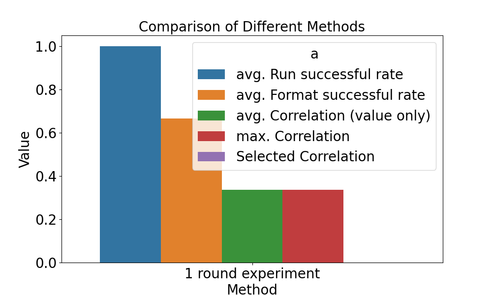

==============================
Benchmark
==============================

Introduction
=============

Benchmarking the capabilities of R&D is a crucial research problem in this area. We are continuously exploring methods to benchmark these capabilities. The current benchmarks are listed on this page.

Development Capability Benchmarking
===================================

Benchmarking is used to evaluate the effectiveness of factors with fixed data. It mainly includes the following steps:

1. :ref:`read and prepare the eval_data <data>`

2. :ref:`declare the method to be tested and pass the arguments <config>`

3. :ref:`declare the eval method and pass the arguments <config>`

4. :ref:`run the eval <run>`

5. :ref:`save and show the result <show>`

Configuration
-------------
.. _config:

.. autopydantic_settings:: rdagent.components.benchmark.conf.BenchmarkSettings

Example
+++++++
.. _example:

The default value for ``bench_test_round`` is 10, which takes about 2 hours to run. To modify it from ``10`` to ``2``, adjust the environment variables in the .env file as shown below.

.. code-block:: Properties

      BENCHMARK_BENCH_TEST_ROUND=2

Data Format
-------------
.. _data:

The sample data in ``bench_data_path`` is a dictionary where each key represents a factor name. The value associated with each key is factor data containing the following information:

- **description**: A textual description of the factor.
- **formulation**: A LaTeX formula representing the model's formulation.
- **variables**: A dictionary of variables involved in the factor.
- **Category**: The category or classification of the factor.
- **Difficulty**: The difficulty level of implementing or understanding the factor.
- **gt_code**: A piece of code associated with the factor.

Here is an example of this data format:

.. literalinclude:: ../../rdagent/components/benchmark/example.json
   :language: json

Ensure the data is placed in the ``FACTOR_COSTEER_SETTINGS.data_folder_debug``. The data files should be in ``.h5`` or ``.md`` format and must not be stored in any subfolders. LLM-Agents will review the file content and implement the tasks.

.. TODO: Add a script to automatically generate the data in the `rdagent/app/quant_factor_benchmark/data` folder.

Run Benchmark
-------------
.. _run:

Start the benchmark after completing the :doc:`../installation_and_configuration`.

.. code-block:: Properties

      dotenv run -- python rdagent/app/benchmark/factor/eval.py

Once completed, a pkl file will be generated, and its path will be printed on the last line of the console.

Show Result
-------------
.. _show:

The ``analysis.py`` script reads data from the pkl file and converts it to an image. Modify the Python code in ``rdagent/app/quant_factor_benchmark/analysis.py`` to specify the path to the pkl file and the output path for the png file.

.. code-block:: Properties

      dotenv run -- python rdagent/app/benchmark/factor/analysis.py <log/path to.pkl>

A png file will be saved to the designated path as shown below.

Related Paper
-------------

- `Towards Data-Centric Automatic R&D <https://arxiv.org/abs/2404.11276>`_:
  We have developed a comprehensive benchmark called RD2Bench to assess data and model R&D capabilities. This benchmark includes a series of tasks that outline the features or structures of models. These tasks are used to evaluate the ability of LLM-Agents to implement them.

.. code-block:: bibtex

    @misc{chen2024datacentric,
        title={Towards Data-Centric Automatic R&D},
        author={Haotian Chen and Xinjie Shen and Zeqi Ye and Wenjun Feng and Haoxue Wang and Xiao Yang and Xu Yang and Weiqing Liu and Jiang Bian},
        year={2024},
        eprint={2404.11276},
        archivePrefix={arXiv},
        primaryClass={cs.AI}
    }

.. image:: https://github.com/user-attachments/assets/494f55d3-de9e-4e73-ba3d-a787e8f9e841

To replicate the benchmark detailed in the paper, please consult the factors listed in the following file: `RD2bench.json <../_static/RD2bench.json>`_.
Please note use ``only_correct_format=False`` when evaluating the results.
