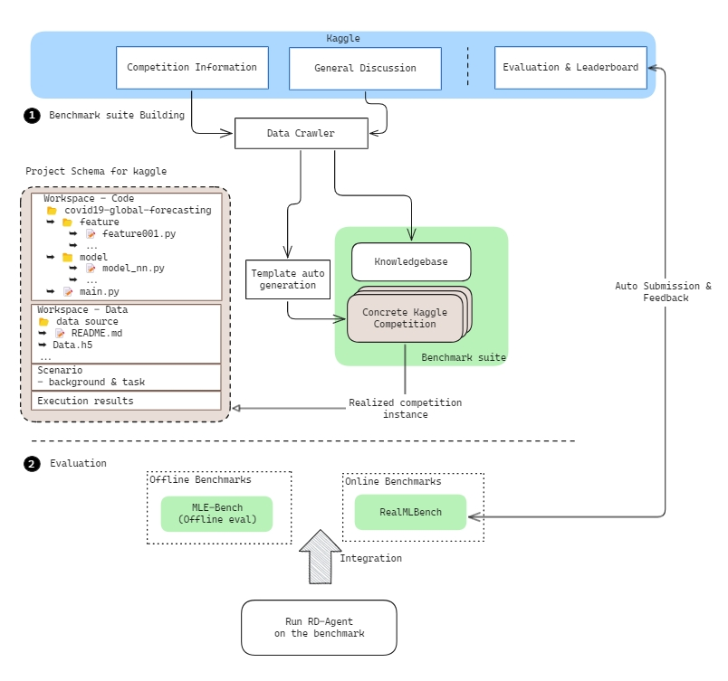
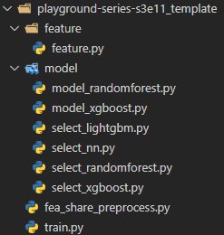

.. _kaggle_agent:

===========================
Data Science Agent - Kaggle
===========================

**🤖 Automated Feature Engineering & Model Tuning Evolution**
------------------------------------------------------------------------------------------

🎨 Design
~~~~~~~~~~~

📖 Background
~~~~~~~~~~~~~~
In the landscape of data science competitions, Kaggle serves as the ultimate arena where data enthusiasts harness the power of algorithms to tackle real-world challenges.
The Kaggle Agent stands as a pivotal tool, empowering participants to seamlessly integrate cutting-edge models and datasets, transforming raw data into actionable insights.

By utilizing the **Kaggle Agent**, data scientists can craft innovative solutions that not only uncover hidden patterns but also drive significant advancements in predictive accuracy and model robustness.

🌟 Introduction
~~~~~~~~~~~~~~~~

In this scenario, our automated system proposes hypothesis, choose action, implements code, conducts validation, and utilizes feedback in a continuous, iterative process.

The goal is to automatically optimize performance metrics within the validation set or Kaggle Leaderboard, ultimately discovering the most efficient features and models through autonomous research and development.

Here's an enhanced outline of the steps:

**Step 1 : Hypothesis Generation 🔍**

- Generate and propose initial hypotheses based on previous experiment analysis and domain expertise, with thorough reasoning and financial justification.

**Step 2 : Experiment Creation ✨**

- Transform the hypothesis into a task.
- Choose a specific action within feature engineering or model tuning.
- Develop, define, and implement a new feature or model, including its name, description, and formulation.

**Step 3 : Model/Feature Implementation 👨‍💻**

- Implement the model code based on the detailed description.
- Evolve the model iteratively as a developer would, ensuring accuracy and efficiency.

**Step 4 : Validation on Test Set or Kaggle 📉**

- Validate the newly developed model using the test set or Kaggle dataset.
- Assess the model's effectiveness and performance based on the validation results.

**Step 5: Feedback Analysis 🔍**

- Analyze validation results to assess performance.
- Use insights to refine hypotheses and enhance the model.

**Step 6: Hypothesis Refinement ♻️**

- Adjust hypotheses based on validation feedback.
- Iterate the process to continuously improve the model.

🧭 Example Guide
~~~~~~~~~~~~~~~~~~~~~~~~~~~~~~~~~~~~~~~~~~~~~~~~

- 🔧 **Set up RD-Agent Environment**

  - Before you start, please make sure you have installed RD-Agent and configured the environment for RD-Agent correctly. If you want to know how to install and configure the RD-Agent, please refer to the `documentation <../installation_and_configuration.html>`_.

- 🔨 **Configuring the Kaggle API**
  
  - Register and login on the `Kaggle <https://www.kaggle.com/>`_ website.
  - Click on the avatar (usually in the top right corner of the page) -> ``Settings`` -> ``Create New Token``, A file called ``kaggle.json`` will be downloaded.
  - Move ``kaggle.json`` to ``~/.config/kaggle/``
  - Modify the permissions of the ``kaggle.json`` file.

    .. code-block:: sh

      chmod 600 ~/.config/kaggle/kaggle.json

  - For more information about Kaggle API Settings, refer to the `Kaggle API <https://github.com/Kaggle/kaggle-api>`_.

- 🔩 **Setting the Environment variables at .env file**

  - Determine the path where the data will be stored and add it to the ``.env`` file.

  .. code-block:: sh

    mkdir -p <your local directory>/kaggle_data
    dotenv set KG_LOCAL_DATA_PATH <your local directory>/kaggle_data

- 📥 **Download Competition Data**

  - Kaggle competition data, contains two parts: competition description file (json file) and competition dataset (zip file).

    - **How to get the competition description file**

      - The competition description file is downloaded automatically when the programme is run, and the download process relies on ``chromedriver``, which can be installed as follows:

        .. code-block:: sh

          # install chrome
          wget https://dl.google.com/linux/direct/google-chrome-stable_current_amd64.deb
          sudo apt install ./google-chrome-stable_current_amd64.deb
          google-chrome --version

          # install chromedriver
          wget "https://storage.googleapis.com/chrome-for-testing-public/$(google-chrome --version | grep -oP '\d+\.\d+\.\d+\.\d+')/linux64/chromedriver-linux64.zip"
          unzip chromedriver-linux64.zip
          cd chromedriver-linux64
          sudo mv chromedriver /usr/local/bin
          sudo chmod +x /usr/local/bin/chromedriver
          chromedriver --version

    - **How to get the competition dataset**

      - The competition dataset is downloaded and extracted automatically when the program is run. If the zip file exists, the download will be skipped, if the unzip folder exists, the unzip will be skipped.

    - **Correct directory structure (Here is an example of competition data with id sf-crime)**

      .. code-block:: text

        kaggle_data
        └── zip_files
        | └── sf-crime.zip
        ├── sample
        | └── sf-crime
        |   └── ...
        ├── sf-crime.json
        └── sf-crime
          └── ...
        
      - ``kaggle_data/zip_files/sf-crime.zip:`` Competition dataset zip files downloaded from the Kaggle website.

      - ``kaggle_data/sf-crime.json:`` Competition description file.

      - ``kaggle_data/sf-crime:`` The target folder for unzipping the competition dataset. Complete dataset.

      - ``kaggle_data/sample/sf-crime:`` Simplified dataset based on the complete dataset. Used to quickly verify that the code works.

- 🗳️ **Join the competition**

  - If your Kaggle API account has not joined a competition, you will need to join the competition before running the program.
    
    - At the bottom of the competition details page, you can find the ``Join the competition`` button, click on it and select ``I Understand and Accept`` to join the competition.
    
    - In the **Competition List Available** below, you can jump to the competition details page.

- 🚀 **Run the Application**

  - You can directly run the application by using the following command:
    
    .. code-block:: sh

        rdagent kaggle --competition <Competition ID>

- 📤 **Submit the Result Automatically or Manually**

  - If Auto: You need to set ``KG_AUTO_SUBMIT`` to ``true`` in the ``.env`` file.

    .. code-block:: sh

      dotenv set KG_AUTO_SUBMIT true
  
  - Else: You can download the prediction results from the UI interface and submit them manually. For more details, refer to the :doc:`UI guide <../ui>`.

🎨 Customize one template for a new competition
~~~~~~~~~~~~~~~~~~~~~~~~~~~~~~~~~~~~~~~~~~~~~~~~
In order to facilitate RD-Agent to generate competition codes, we have specified a competition code structure:

- **feature directory** contains the feature engineering code. Generally no modification is required.
- **model directory** contains the model codes.
  select_xx.py is used to select different features according to different models.
  model_xx.py is the basic code of different models. Generally, only some initial parameters need to be adjusted.
- **fea_share_preprocess.py** is some basic preprocessing code shared by different models. The degree of customization here is high, but the preprocess_script() function needs to be retained, which will be called by train.py
- **train.py** is the main code, which connects all the codes and is also the code called during the final execution.

**We will soon provide a tool for automatic/semi-automatic template generation.**
If you want to try a different competition now, you can refer to our current template structure and content to write a new template.

🎯 Roadmap
~~~~~~~~~~~

**Completed:**

- **Kaggle Project Schema Design** ✅

- **RD-Agent Integration with kaggle schema** ✅

**Ongoing:**

- **Template auto generation**

- **Bench Optimization**

  - **Online Bench**

    - **RealMLBench**

      - Ongoing integration

      - Auto online submission

      - Batch Evaluation

  - **Offline Bench**
  
    - MLE-Bench

🛠️ Usage of modules
~~~~~~~~~~~~~~~~~~~~~

.. _Env Config: 

- **Env Config**

The following environment variables can be set in the `.env` file to customize the application's behavior:

.. autopydantic_settings:: rdagent.app.kaggle.conf.KaggleBasePropSetting
    :settings-show-field-summary: False
    :exclude-members: Config

.. autopydantic_settings:: rdagent.components.coder.factor_coder.config.FactorCoSTEERSettings
    :settings-show-field-summary: False
    :members: coder_use_cache, file_based_execution_timeout, select_method, max_loop
    :exclude-members: Config, fail_task_trial_limit, v1_query_former_trace_limit, v1_query_similar_success_limit, v2_query_component_limit, v2_query_error_limit, v2_query_former_trace_limit, v2_error_summary, v2_knowledge_sampler, v2_add_fail_attempt_to_latest_successful_execution, new_knowledge_base_path, knowledge_base_path, data_folder, data_folder_debug
    :no-index:
