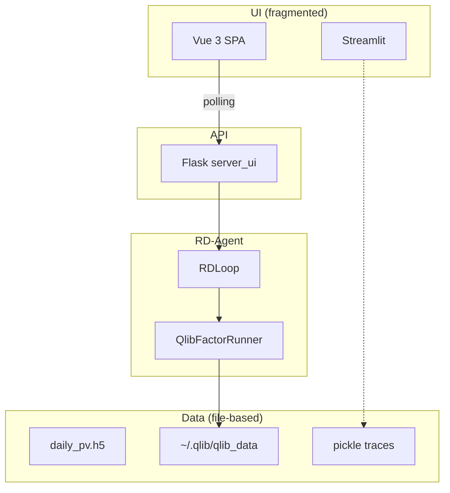
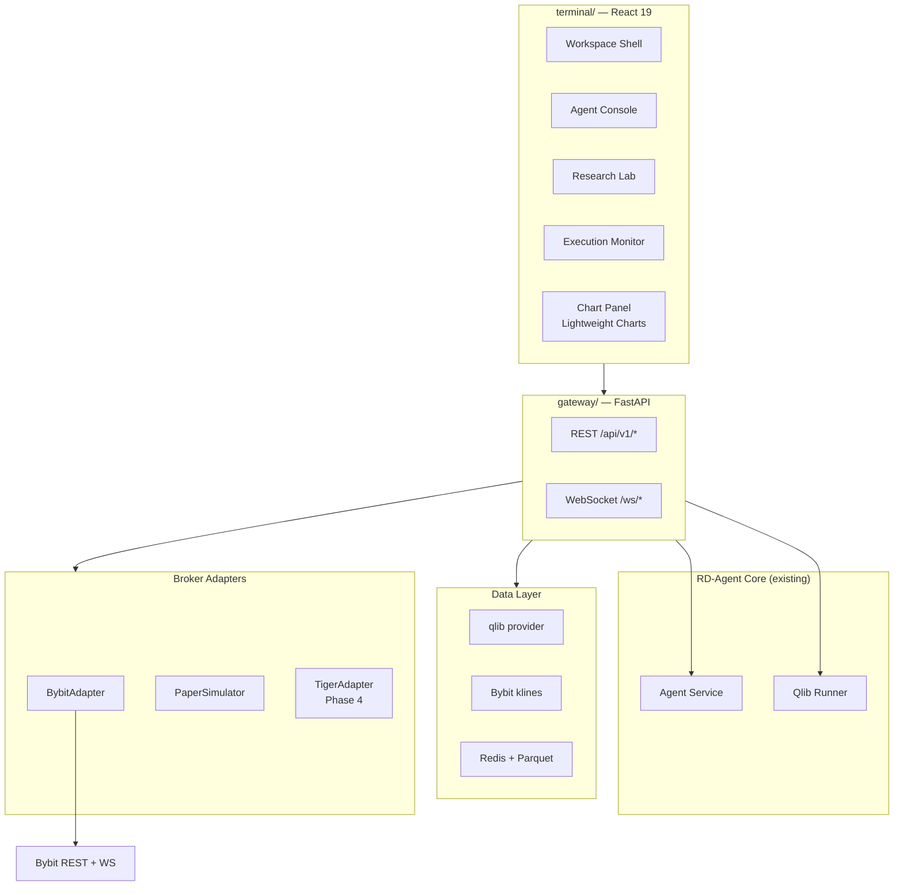

# RD-Agent Terminal — Архитектурный анализ и план реализации

> **Версия документа:** 1.0  
> **Дата:** 2026-05-23  
> **Статус:** Утверждён к реализации PR #1  
> **Git checkpoint (точка возврата):** `aa42a7b0` — `checkpoint: save return point before terminal PR #1`

---

## Содержание

1. [Executive Summary](#1-executive-summary)
2. [Продуктовые решения (Q1–Q6)](#2-продуктовые-решения-q1q6)
3. [Анализ текущего состояния (As-Is)](#3-анализ-текущего-состояния-as-is)
4. [Целевая архитектура (To-Be)](#4-целевая-архитектура-to-be)
5. [Технологический стек](#5-технологический-стек)
6. [Слой данных (Data Layer)](#6-слой-данных-data-layer)
7. [Интеграция с внешними терминалами и сервисами](#7-интеграция-с-внешними-терминалами-и-сервисами)
8. [GitHub-экосистема: анализ и shortlist](#8-github-экосистема-анализ-и-shortlist)
9. [Best Practices Matrix](#9-best-practices-matrix)
10. [Risk Management Layer](#10-risk-management-layer)
11. [Структура репозитория](#11-структура-репозитория)
12. [API Specification](#12-api-specification)
13. [Roadmap: Phase 1–4](#13-roadmap-phase-14)
14. [PR #1 — Доскональный план реализации](#14-pr-1--доскональный-план-реализации)
15. [Local Deployment (Windows + WSL2)](#15-local-deployment-windows--wsl2)
16. [Критерии приёмки и Definition of Done](#16-критерии-приёмки-и-definition-of-done)
17. [Rollback и управление версиями](#17-rollback-и-управление-версиями)
18. [Открытые вопросы и решения по умолчанию](#18-открытые-вопросы-и-решения-по-умолчанию)
19. [Приложения](#19-приложения)

---

## 1. Executive Summary

### 1.1. Контекст

**RD-Agent** (Microsoft) — LLM-driven R&D automation framework для quant finance, Kaggle, paper-to-model и смежных сценариев. Execution engine для финансовых quant-сценариев — **Microsoft Qlib**. Текущий UI фрагментирован: Vue 3 SPA + Flask (`server_ui`) для agent loop и Streamlit для глубокой qlib-аналитики.

### 1.2. Стратегическая цель

Построить **RD-Agent Terminal** — профессиональный full-stack trading/research terminal, объединяющий:

| Зона | Назначение |
|------|------------|
| **Agent Console** | LLM R&D loop: hypothesis → code → run → feedback |
| **Research Lab** | qlib metrics: IC, returns, drawdown, factor analysis |
| **Execution Monitor** | Live/paper trading, positions, orders, P&L, risk |

### 1.3. Ключевые решения заказчика

| Вопрос | Решение | Интерпретация |
|--------|---------|---------------|
| Q1 | **C** | Full terminal: research + live execution + risk management |
| Q2 | **C** (Bybit first) | Multi-market; Phase 1 execution = **Bybit crypto** |
| Q3 | **B** | Migrate to **React terminal-style** UI |
| Q4 | **A** | **TradingView Lightweight Charts** (Apache-2.0) |
| Q5 | **A** | Local self-hosted (Windows dev + WSL2/Docker для qlib) |
| Q6 | **A** (Tiger) | Equities execution в **Phase 4**, после Bybit MVP |

### 1.4. Scope PR #1

PR #1 — foundation layer без agent bridge и без order placement:

- Scaffold `terminal/` — React 19 + TypeScript + Vite
- Scaffold `gateway/` — FastAPI API gateway
- **BybitAdapter** — read-only market data (klines, symbols, ticker)
- **Lightweight Charts** — OHLC panel с live/historical данными
- Workspace shell (react-grid-layout)
- `docker-compose.terminal.yml` + документация dev setup

### 1.5. Принципиальное ограничение

**Qlib** оптимизирован под equities (CSI300 и т.д.). **Bybit** — crypto perpetuals/spot. На Phase 1 это **два параллельных track**:

- **Quant R&D track** — существующий RD-Agent + qlib (без изменений в PR #1)
- **Market/Execution track** — Bybit data + chart (PR #1)

Связка signal → order — Phase 3.

---

## 2. Продуктовые решения (Q1–Q6)

### 2.1. Q1 = C — Full Terminal

#### 2.1.1. Что включает
- Agent orchestration UI (RD loop live)
- Research analytics (qlib backtest results)
- Execution monitor (orders, positions)
- Risk management layer (kill switch, limits)

#### 2.1.2. Что исключает на Phase 1
- Live order placement (Phase 3)
- Automated signal-to-order без manual approval (Phase 3+)

#### 2.1.3. Последствия для архитектуры
- Обязателен **Broker Adapter Pattern** с самого начала
- Risk controls проектируются до первого live order
- Audit trail для всех execution events

### 2.2. Q2 = C — Multi-market, Bybit first

#### 2.2.1. Phase 1 — Bybit (crypto)
- Products: **Linear USDT Perpetuals** (BTCUSDT, ETHUSDT, …)
- Environment: **testnet default**
- SDK: [pybit](https://github.com/bybit-exchange/pybit) v5 unified trading

#### 2.2.2. Phase 2–3 — Research data expansion
- qlib CN equities (existing)
- Bybit klines → parquet cache для crypto backtest

#### 2.2.3. Phase 4 — Multi-broker
- **Tiger Trade** — US/HK/CN equities (tigeropen SDK)
- Optional: Alpaca, Interactive Brokers

#### 2.2.4. Разрешение конфликта Q6 vs Q2
Q6 (Tiger) откладывается до Phase 4. Execution priority: **Bybit → Paper → Tiger**.

### 2.3. Q3 = B — React Terminal Migration

#### 2.3.1. Новый primary UI
- Директория `terminal/` — React 19 + TypeScript + Vite
- Terminal-style UX: command bar, workspace panels, status bar

#### 2.3.2. Legacy UI
- `web/` (Vue 3) — **deprecated**, не удалять до Phase 2 completion
- Streamlit — debug/internal only после Phase 2

#### 2.3.3. Migration strategy
- Parallel run: Vue + React coexist Phase 1–2
- Feature parity Agent Console — Phase 2
- Vue removal — Phase 2 end

### 2.4. Q4 = A — Lightweight Charts

#### 2.4.1. Выбрано
- [tradingview/lightweight-charts](https://github.com/tradingview/lightweight-charts) v5.x
- License: Apache-2.0, бесплатно

#### 2.4.2. Не выбрано
- TradingView Charting Library (commercial, ~$3k+/year)
- TradingView embed widget (ограничен, не для custom signals)

#### 2.4.3. Разделение charting
| Тип данных | Библиотека |
|------------|------------|
| OHLC, volume, signal markers | Lightweight Charts |
| IC distribution, equity curve, drawdown | Recharts / uPlot (Phase 2) |

### 2.5. Q5 = A — Local Self-Hosted

#### 2.5.1. Windows dev
- `terminal/` — native `npm run dev`
- `gateway/` — Python venv на Windows (pybit works on Windows)

#### 2.5.2. qlib execution
- WSL2 + Docker Desktop
- `MODEL_CoSTEER_env_type=docker`
- Bind mount `~/.qlib` → container

#### 2.5.3. Production path (future)
- Linux Docker Compose
- Optional cloud (Azure — RD-Agent demo already exists)

### 2.6. Q6 = A — Tiger (Phase 4)

- SDK: [tigerfintech/openapi-python-sdk](https://github.com/tigerfintech/openapi-python-sdk)
- MCP Server уже доступен для AI tooling
- Markets: US, HK, CN equities
- Integration via `TigerAdapter(BrokerAdapter)`

---

## 3. Анализ текущего состояния (As-Is)

### 3.1. Структура проекта

```
RD-Agent/
├── rdagent/              # Core Python package (~679 files)
│   ├── app/              # CLI: fin_factor, fin_model, fin_quant, …
│   ├── components/       # CoSTEER coders, workflow
│   ├── core/             # Experiment, proposal, scenario abstractions
│   ├── log/              # Logging, trace storage, UIs
│   │   ├── server/app.py # Flask server_ui
│   │   └── ui/           # Streamlit apps
│   ├── scenarios/qlib/   # Qlib integration
│   │   └── developer/factor_runner.py
│   └── utils/env.py      # Qlib Docker/Conda
├── web/                  # Vue 3 + Vite (legacy → deprecated)
├── docs/                 # Sphinx documentation
└── git_ignore_folder/    # Runtime: traces, static, workspace
```

### 3.2. UI Layer — три поверхности

| Surface | Stack | Entry | Назначение |
|---------|-------|-------|------------|
| Vue SPA | Vue 3, Element Plus, ECharts | `rdagent server_ui` | Agent loop, upload, trace polling |
| Flask API | Flask + CORS | port 19899 | `/upload`, `/trace`, `/control` |
| Streamlit | Plotly | `rdagent ui` | qlib deep analytics, DS scenario |

### 3.3. Flask API (existing)

| Method | Route | Purpose |
|--------|-------|---------|
| POST | `/upload` | Start scenario subprocess |
| POST | `/trace` | Poll incremental trace messages |
| GET | `/traces` | List trace IDs |
| POST | `/control` | Stop process |
| POST | `/receive` | WebStorage log ingest |
| POST | `/user_interaction/submit` | User input to agent |

**Limitation:** polling-only, no WebSocket, no OpenAPI spec.

### 3.4. Qlib Integration Flow

```
QlibFactorRunner.develop()
  → process_factor_data()           # execute factor code
  → deduplicate vs SOTA (IC corr)
  → combined_factors_df.parquet
  → QlibFBWorkspace.execute()
      → Docker/conda: qrun conf_*.yaml
      → read_exp_res.py → qlib_res.csv, ret.pkl
  → exp.result = metrics (IC, excess return, drawdown)
```

**Key file:** `rdagent/scenarios/qlib/developer/factor_runner.py`

### 3.5. Data Layer (existing)

| Source | Mechanism | Output |
|--------|-----------|--------|
| Qlib CN | `~/.qlib/qlib_data/cn_data` | HDF5 `daily_pv.h5` |
| User upload | JSON/code via UI | `git_ignore_folder/traces/uploads/` |
| Artifacts | qlib qrun | `ret.pkl`, `qlib_res.csv`, mlruns |
| Traces | pickle | `git_ignore_folder/traces/` |

**Gap:** нет unified REST API для market data; нет broker integration.

### 3.6. Выявленные проблемы

| # | Problem | Impact | PR #1 address |
|---|---------|--------|-----------------|
| 1 | Dual UI (Vue + Streamlit) | Maintenance burden | Start React parallel |
| 2 | Flask polling | Poor UX for long jobs | WebSocket in Phase 2 |
| 3 | No market data API | Can't show live charts | **Bybit via gateway** |
| 4 | No execution layer | No trading | Read-only positions Phase 1 |
| 5 | Linux-first qlib | Windows friction | WSL2 docs |
| 6 | No auth | Security risk for live trading | Phase 3 |

### 3.7. As-Is Diagram



---

## 4. Целевая архитектура (To-Be)

### 4.1. High-Level Architecture



### 4.2. Separation of Concerns

| Layer | Responsibility | Changes in PR #1 |
|-------|----------------|------------------|
| **Presentation** | Terminal UI, charts, workspace | **NEW** `terminal/` |
| **Gateway** | REST/WS, routing, CORS | **NEW** `gateway/` |
| **Agent** | LLM R&D loop | No change |
| **Research** | qlib backtest, metrics | No change (Phase 2 API) |
| **Market Data** | Klines, symbols, ticker | **NEW** BybitAdapter |
| **Execution** | Orders, positions | Read-only Phase 1 |
| **Risk** | Limits, kill switch | Design only Phase 1 |

### 4.3. Broker Adapter Pattern

```python
# gateway/app/brokers/base.py — contract

class BrokerAdapter(ABC):
    broker_id: str
    market_type: Literal["crypto", "equity", "option"]

    async def get_symbols(self) -> list[Symbol]: ...
    async def get_klines(self, symbol, interval, limit) -> list[OHLCV]: ...
    async def get_ticker(self, symbol) -> Ticker: ...
    async def get_positions(self) -> list[Position]: ...      # Phase 1 read-only
    async def get_orders(self, status=None) -> list[Order]: ... # Phase 1 read-only
    async def place_order(self, order: OrderRequest) -> OrderResult: ...  # Phase 3
    async def cancel_order(self, order_id: str) -> bool: ...              # Phase 3
```

**Implementations:**

| Adapter | Phase | Mode |
|---------|-------|------|
| `BybitAdapter` | 1 | testnet, read-only market + positions |
| `PaperAdapter` | 3 | simulated execution |
| `TigerAdapter` | 4 | equities paper → live |

---

## 5. Технологический стек

### 5.1. Frontend (`terminal/`)

| Component | Technology | Version | Purpose |
|-----------|------------|---------|---------|
| Framework | React | 19.x | UI |
| Language | TypeScript | 5.x | Type safety |
| Build | Vite | 6.x | Dev server, HMR |
| Styling | Tailwind CSS | 4.x | Utility-first CSS |
| Components | shadcn/ui | latest | Accessible UI primitives |
| Layout | react-grid-layout | 1.x | Drag-drop workspace panels |
| Charts (market) | lightweight-charts | 5.x | OHLC, volume |
| Charts (analytics) | Recharts | 2.x | Phase 2: IC, equity |
| State | Zustand | 5.x | Client state |
| Server state | TanStack Query | 5.x | API cache, refetch |
| Routing | React Router | 7.x | SPA routes |
| HTTP | fetch / axios | — | REST client |

### 5.2. Backend (`gateway/`)

| Component | Technology | Purpose |
|-----------|------------|---------|
| Framework | FastAPI | 0.115+ | Async REST + WS |
| Server | Uvicorn | ASGI |
| Bybit SDK | pybit | 5.x | Official Bybit v5 |
| Validation | Pydantic | 2.x | Request/response models |
| Cache | Redis | 7.x | Klines cache (optional Phase 1) |
| Config | pydantic-settings | .env loading |

### 5.3. Existing (unchanged in PR #1)

| Component | Role |
|-----------|------|
| RD-Agent core | Agent orchestration |
| Qlib | Research backtest |
| Flask server_ui | Legacy, proxied in Phase 2 |
| Docker qlib image | Research execution |

---

## 6. Слой данных (Data Layer)

### 6.1. Multi-Market Data Matrix

| Market | Source | Format | Research | Execution | Phase |
|--------|--------|--------|----------|-----------|-------|
| Crypto (Bybit) | pybit klines API | JSON → normalized OHLCV | vectorbt (Phase 2) | Bybit testnet | **1** |
| CN Equities | qlib `cn_data` | HDF5, parquet | qlib qrun | Paper only | existing |
| US Equities | — | — | qlib custom | Tiger (Phase 4) | 4 |

### 6.2. Bybit Market Data (PR #1)

#### 6.2.1. Endpoints used (pybit HTTP)
- `get_kline()` — historical OHLCV
- `get_tickers()` — last price, 24h change
- `get_instruments_info()` — symbol list (linear category)

#### 6.2.2. Normalized OHLCV schema

```typescript
interface OHLCVBar {
  time: number;      // Unix timestamp (seconds)
  open: number;
  high: number;
  low: number;
  close: number;
  volume: number;
}
```

#### 6.2.3. Supported intervals (Phase 1)
`1`, `5`, `15`, `60`, `240`, `D` (Bybit interval codes)

#### 6.2.4. Default symbols
`BTCUSDT`, `ETHUSDT`, `SOLUSDT`

### 6.3. Caching Strategy

| Data | TTL | Storage | Phase |
|------|-----|---------|-------|
| Klines (historical) | 60s | In-memory / Redis | 1 |
| Ticker | 5s | In-memory | 1 |
| Symbol list | 1h | In-memory | 1 |

### 6.4. Qlib Artifacts (Phase 2)

| File | Content | API endpoint |
|------|---------|--------------|
| `qlib_res.csv` | IC, returns, drawdown | `/research/{id}/metrics` |
| `ret.pkl` | Daily returns series | `/research/{id}/returns` |
| `combined_factors_df.parquet` | Factor values | `/research/{id}/factors` |

---

## 7. Интеграция с внешними терминалами и сервисами

### 7.1. TradingView

| Product | License | Use in RD-Agent Terminal |
|---------|---------|--------------------------|
| **Lightweight Charts** | Apache-2.0 | **Primary** — OHLC, volume, markers |
| Charting Library | Commercial | Not planned |
| Embed Widget | Limited free | Not suitable |
| Pine Script | TV platform only | Out of scope |

**Integration pattern:**
- Gateway serves klines JSON
- React component wraps `createChart()` from lightweight-charts
- Phase 2: overlay entry/exit markers from `ret.pkl`

### 7.2. Bybit

| Aspect | Detail |
|--------|--------|
| API | [Bybit V5](https://bybit-exchange.github.io/docs/v5/intro) |
| SDK | [pybit](https://github.com/bybit-exchange/pybit) |
| Auth | API Key + Secret (HMAC) |
| Testnet | `testnet=True` in pybit |
| WS | Phase 1 optional; Phase 3 for live ticker |
| Products | Linear perpetuals (USDT-M) |

**Security:**
- Read-only API keys for Phase 1–2
- Trade keys only Phase 3 with risk gate
- Keys in `.env`, never committed

### 7.3. Tiger Trade (Phase 4)

| Aspect | Detail |
|--------|--------|
| SDK | tigeropen Python |
| Markets | US, HK, CN |
| MCP | Available for AI agent integration |
| Use case | Equities execution after crypto MVP |

### 7.4. OpenBB (Optional Phase 2+)

| Aspect | Detail |
|--------|--------|
| ODP | Data layer abstraction |
| Workspace | Enterprise UI at pro.openbb.co |
| Integration | Custom backend with `widgets.json` |
| Use case | Macro/fundamentals widgets alongside terminal |

---

## 8. GitHub-экосистема: анализ и shortlist

### 8.1. Tier 1 — Integrate as library/module

| Repo | Stars | Fit | Effort | License | Action |
|------|-------|-----|--------|---------|--------|
| [tradingview/lightweight-charts](https://github.com/tradingview/lightweight-charts) | 14k | 9/10 | Low | Apache-2.0 | npm install in terminal |
| [bybit-exchange/pybit](https://github.com/bybit-exchange/pybit) | 654 | 9/10 | Low | — | pip install in gateway |
| [microsoft/RD-Agent](https://github.com/microsoft/RD-Agent) | — | 10/10 | — | MIT | Base project |
| [microsoft/qlib](https://github.com/microsoft/qlib) | 40k | 10/10 | — | MIT | Research engine |

### 8.2. Tier 2 — Architecture reference (no fork)

| Repo | What to borrow |
|------|----------------|
| [vaughanf1/BB-Terminal](https://github.com/vaughanf1/BB-Terminal) | Command bar, amber terminal theme, workspace tabs |
| [tanishq-ctrl/market-risk-engine](https://github.com/tanishq-ctrl/market-risk-engine) | React+shadcn structure, typed API client |
| [sajalkmr/backdash](https://github.com/sajalkmr/backdash) | FastAPI+WebSocket+Celery job pattern |
| [DarkLink/QuantPits](https://github.com/DarkLink/QuantPits) | qlib rolling health dashboard patterns |
| [yuanyihan/qlib_factor_platform](https://github.com/yuanyihan/qlib_factor_platform) | IC analysis UI, akshare adapter |

### 8.3. Tier 3 — Do not integrate

| Repo | Reason |
|------|--------|
| Apex-Trading | Full competing platform, massive overlap |
| AgentQuant | Different agent stack (LangGraph+Gemini) |
| quantlab | Duplicates qlib workflow |

---

## 9. Best Practices Matrix

| Practice | Source | Apply when |
|----------|--------|------------|
| 3-zone UI (Console/Lab/Execution) | Apex, BB-Terminal | Phase 1 layout |
| Broker Adapter Pattern | Industry standard | Phase 1 (interface) |
| FastAPI + WebSocket | BackDash | Phase 2 agent trace |
| Testnet default | Crypto best practice | Phase 1–3 |
| Manual approval gate | Risk best practice | Phase 3 |
| Separate read/trade API keys | Security | Phase 1+ |
| OpenAPI spec | API best practice | Phase 1 gateway |
| Dark fintech theme | BB-Terminal, market-risk-engine | Phase 1 |
| `tabular-nums` for metrics | Typography best practice | Phase 1 |
| Checkpoint commits before major work | Git best practice | **Done: aa42a7b0** |

---

## 10. Risk Management Layer

### 10.1. Design Principles (Q1=C)

Risk layer проектируется **до** первого live order. PR #1 — только design stub.

### 10.2. Controls Matrix

| Control | Phase | Implementation |
|---------|-------|----------------|
| Testnet default | 1 | `BYBIT_TESTNET=true` in .env |
| Read-only API keys | 1–2 | Bybit key permissions |
| Manual order approval | 3 | UI confirm dialog + server gate |
| Max notional per symbol | 3 | `RiskManager.check_order()` |
| Daily loss limit | 3 | Auto kill-switch |
| Kill switch | 3 | `POST /execution/kill-switch` |
| Audit log | 3 | SQLite/PostgreSQL |
| Separate mainnet toggle | 3 | Env + UI double confirm |

### 10.3. PR #1 Risk Scope

- **No order placement**
- Testnet-only configuration
- Document risk requirements in this plan
- `gateway/app/services/risk_manager.py` — stub with docstrings only

---

## 11. Структура репозитория

### 11.1. New Directories (PR #1)

```
RD-Agent/
├── terminal/                         # NEW — React terminal
│   ├── index.html
│   ├── package.json
│   ├── vite.config.ts
│   ├── tailwind.config.js
│   ├── tsconfig.json
│   ├── components.json               # shadcn config
│   └── src/
│       ├── main.tsx
│       ├── App.tsx
│       ├── app/
│       │   ├── router.tsx
│       │   └── providers.tsx
│       ├── pages/
│       │   └── CommandCenter.tsx
│       ├── components/
│       │   ├── workspace/
│       │   │   ├── WorkspaceShell.tsx
│       │   │   ├── Panel.tsx
│       │   │   └── StatusBar.tsx
│       │   ├── charts/
│       │   │   └── CandlestickChart.tsx
│       │   └── ui/                   # shadcn components
│       ├── lib/
│       │   ├── api.ts
│       │   ├── format.ts
│       │   └── utils.ts
│       └── stores/
│           └── workspaceStore.ts
│
├── gateway/                          # NEW — FastAPI gateway
│   ├── pyproject.toml
│   ├── requirements.txt
│   └── app/
│       ├── __init__.py
│       ├── main.py
│       ├── config.py
│       ├── models/
│       │   └── market.py
│       ├── routers/
│       │   ├── health.py
│       │   └── market.py
│       ├── brokers/
│       │   ├── base.py
│       │   └── bybit.py
│       └── services/
│           └── risk_manager.py       # stub
│
├── docs/terminal/
│   └── IMPLEMENTATION_PLAN.md        # THIS FILE
│
└── docker-compose.terminal.yml       # NEW
```

### 11.2. Unchanged (PR #1)

```
rdagent/          # No modifications
web/              # Legacy Vue, parallel run
```

---

## 12. API Specification

### 12.1. PR #1 Endpoints

#### 12.1.1. Health

```
GET /api/v1/health
```

Response:
```json
{
  "status": "ok",
  "version": "0.1.0",
  "brokers": ["bybit"],
  "testnet": true
}
```

#### 12.1.2. Symbols

```
GET /api/v1/market/symbols?broker=bybit&category=linear
```

Response:
```json
{
  "broker": "bybit",
  "symbols": [
    {"symbol": "BTCUSDT", "baseCoin": "BTC", "quoteCoin": "USDT", "status": "Trading"}
  ]
}
```

#### 12.1.3. Klines

```
GET /api/v1/market/klines?broker=bybit&symbol=BTCUSDT&interval=60&limit=500
```

Response:
```json
{
  "broker": "bybit",
  "symbol": "BTCUSDT",
  "interval": "60",
  "bars": [
    {"time": 1716508800, "open": 64230.5, "high": 64500.0, "low": 63800.0, "close": 64350.0, "volume": 1234.56}
  ]
}
```

#### 12.1.4. Ticker

```
GET /api/v1/market/ticker?broker=bybit&symbol=BTCUSDT
```

Response:
```json
{
  "symbol": "BTCUSDT",
  "lastPrice": 64350.0,
  "price24hPcnt": 2.34,
  "volume24h": 123456.78,
  "highPrice24h": 65000.0,
  "lowPrice24h": 63000.0
}
```

### 12.2. Phase 2+ Endpoints (reference)

```
# Agent (bridge Flask)
POST /api/v1/agent/run
GET  /api/v1/agent/trace/{id}
WS   /ws/agent/trace/{id}

# Research (qlib artifacts)
GET  /api/v1/research/experiments
GET  /api/v1/research/{trace_id}/metrics
GET  /api/v1/research/{trace_id}/returns

# Execution (Phase 3)
GET  /api/v1/execution/positions?broker=bybit
POST /api/v1/execution/orders
POST /api/v1/execution/kill-switch
WS   /ws/execution/updates
```

---

## 13. Roadmap: Phase 1–4

### 13.1. Phase 1 — Terminal Shell + Bybit Data (PR #1, 3–4 weeks)

| Deliverable | Status |
|-------------|--------|
| React terminal scaffold | PR #1 |
| FastAPI gateway | PR #1 |
| Bybit klines API | PR #1 |
| Lightweight Charts panel | PR #1 |
| Workspace layout | PR #1 |
| docker-compose | PR #1 |

### 13.2. Phase 2 — Agent Console + Research Lab (4–5 weeks)

| Deliverable | Description |
|-------------|-------------|
| Agent bridge | Proxy Flask `/upload`, `/trace` |
| WebSocket trace | Replace polling |
| qlib_reader service | Parse ret.pkl, qlib_res.csv |
| Research panels | IC, equity curve, drawdown |
| Signal overlay | Markers on Lightweight Charts |
| Vue deprecation | Redirect to terminal |

### 13.3. Phase 3 — Full Execution + Risk (5–6 weeks)

| Deliverable | Description |
|-------------|-------------|
| Order ticket UI | Limit/market/stop |
| RiskManager | Limits, kill switch |
| Signal export | Validated signal → order preview |
| PaperAdapter | Simulated execution |
| Live P&L stream | Bybit WS |
| Audit log | All orders tracked |

### 13.4. Phase 4 — Multi-market Expansion

| Deliverable | Description |
|-------------|-------------|
| TigerAdapter | US/HK/CN equities |
| OpenBB widgets | Optional macro data |
| Crypto quant R&D | RD-Agent crypto scenario or vectorbt |
| IB/Alpaca | On demand |

---

## 14. PR #1 — Доскональный план реализации

### 14.1. Общие параметры PR #1

| Parameter | Value |
|-----------|-------|
| Branch name | `feat/terminal-pr1-scaffold` |
| Base commit | `aa42a7b0` |
| Estimated effort | 5–7 dev-days |
| Reviewers | 1+ |
| Breaking changes | None (additive only) |

---

### 14.2. Epic 1: Repository Scaffold

#### 14.2.1. Task 1.1 — Create branch

- [ ] **1.1.1** Checkout from `aa42a7b0`
  ```bash
  git checkout -b feat/terminal-pr1-scaffold aa42a7b0
  ```
- [ ] **1.1.2** Verify clean working tree

#### 14.2.2. Task 1.2 — Directory structure

- [ ] **1.2.1** Create `terminal/` root
- [ ] **1.2.2** Create `gateway/` root
- [ ] **1.2.3** Create `docs/terminal/` (this file)
- [ ] **1.2.4** Add entries to root `.gitignore`:
  - `terminal/node_modules/`
  - `terminal/dist/`
  - `gateway/.venv/`
  - `gateway/__pycache__/`

**Acceptance:** Directories exist, gitignore updated.

---

### 14.3. Epic 2: Gateway (FastAPI + Bybit)

#### 14.3.1. Task 2.1 — Python project setup

- [ ] **2.1.1** Create `gateway/pyproject.toml`:
  - name: `rdagent-gateway`
  - python: `>=3.10`
  - dependencies: `fastapi`, `uvicorn[standard]`, `pybit`, `pydantic-settings`, `httpx`
- [ ] **2.1.2** Create `gateway/requirements.txt` (pinned versions)
- [ ] **2.1.3** Create `gateway/app/__init__.py`

#### 14.3.2. Task 2.2 — Configuration

- [ ] **2.2.1** Create `gateway/app/config.py`:
  ```python
  class Settings(BaseSettings):
      gateway_host: str = "0.0.0.0"
      gateway_port: int = 6900
      cors_origins: list[str] = ["http://localhost:5173"]
      bybit_testnet: bool = True
      bybit_api_key: str = ""
      bybit_api_secret: str = ""
  ```
- [ ] **2.2.2** Add to `.env.example`:
  ```env
  # Terminal Gateway (Bybit)
  GATEWAY_PORT=6900
  BYBIT_TESTNET=true
  BYBIT_API_KEY=
  BYBIT_API_SECRET=
  ```
- [ ] **2.2.3** Document: empty keys OK for public market data

#### 14.3.3. Task 2.3 — Broker Adapter interface

- [ ] **2.3.1** Create `gateway/app/brokers/base.py`:
  - `Symbol`, `OHLCVBar`, `Ticker` Pydantic models
  - `BrokerAdapter` ABC with methods from §4.3
- [ ] **2.3.2** Create `BrokerRegistry` dict for adapter lookup

#### 14.3.4. Task 2.4 — BybitAdapter implementation

- [ ] **2.4.1** Create `gateway/app/brokers/bybit.py`
- [ ] **2.4.2** Implement `get_symbols()`:
  - pybit `HTTP.get_instruments_info(category="linear")`
  - Filter `status == "Trading"`
  - Map to `Symbol` model
- [ ] **2.4.3** Implement `get_klines()`:
  - pybit `HTTP.get_kline(category="linear", symbol, interval, limit)`
  - Map to `OHLCVBar[]`, sort by time ascending
  - Handle pagination if limit > 1000
- [ ] **2.4.4** Implement `get_ticker()`:
  - pybit `HTTP.get_tickers(category="linear", symbol)`
- [ ] **2.4.5** Error handling:
  - Bybit API errors → HTTP 502 with message
  - Invalid symbol → HTTP 404
  - Rate limit → HTTP 429
- [ ] **2.4.6** Unit tests with mocked pybit responses

#### 14.3.5. Task 2.5 — API Routers

- [ ] **2.5.1** Create `gateway/app/routers/health.py`
- [ ] **2.5.2** Create `gateway/app/routers/market.py`:
  - `GET /symbols`
  - `GET /klines`
  - `GET /ticker`
- [ ] **2.5.3** Create `gateway/app/main.py`:
  - FastAPI app factory
  - CORS middleware
  - Include routers under `/api/v1`
  - OpenAPI at `/docs`

#### 14.3.6. Task 2.6 — Risk manager stub

- [ ] **2.6.1** Create `gateway/app/services/risk_manager.py`
- [ ] **2.6.2** Docstring-only class with planned methods
- [ ] **2.6.3** No enforcement in PR #1

#### 14.3.7. Task 2.7 — Gateway CLI entry

- [ ] **2.7.1** Add run script or document:
  ```bash
  cd gateway && uvicorn app.main:app --host 0.0.0.0 --port 6900 --reload
  ```

**Acceptance Epic 2:**
- `GET /api/v1/health` returns 200
- `GET /api/v1/market/klines?symbol=BTCUSDT&interval=60&limit=100` returns valid OHLCV
- OpenAPI docs accessible at `http://localhost:6900/docs`

---

### 14.4. Epic 3: Terminal (React + Charts)

#### 14.4.1. Task 3.1 — Vite project scaffold

- [ ] **3.1.1** Initialize with `npm create vite@latest terminal -- --template react-ts`
- [ ] **3.1.2** Install dependencies:
  ```bash
  npm install react-router-dom @tanstack/react-query zustand
  npm install lightweight-charts react-grid-layout
  npm install -D tailwindcss @tailwindcss/vite
  ```
- [ ] **3.1.3** Initialize shadcn/ui:
  ```bash
  npx shadcn@latest init
  npx shadcn@latest add button select badge separator
  ```

#### 14.4.2. Task 3.2 — Theme and layout

- [ ] **3.2.1** Configure Tailwind dark theme:
  - Background: `#0a0e17`
  - Accent: amber `#f59e0b`, green `#22c55e`
  - Font: system + monospace for numbers
- [ ] **3.2.2** Create `src/app/providers.tsx`:
  - QueryClientProvider
  - Theme provider (dark default)
- [ ] **3.2.3** Create `src/app/router.tsx`:
  - `/` → CommandCenter
  - `/chart` → optional full-screen chart

#### 14.4.3. Task 3.3 — API client

- [ ] **3.3.1** Create `src/lib/api.ts`:
  ```typescript
  const BASE = import.meta.env.VITE_GATEWAY_URL ?? "http://localhost:6900";
  export async function fetchKlines(symbol, interval, limit): Promise<OHLCVBar[]>
  export async function fetchTicker(symbol): Promise<Ticker>
  export async function fetchSymbols(): Promise<Symbol[]>
  ```
- [ ] **3.3.2** Create `src/lib/types.ts` — mirror gateway Pydantic models
- [ ] **3.3.3** Create TanStack Query hooks:
  - `useKlines(symbol, interval)`
  - `useTicker(symbol)`
  - `useSymbols()`

#### 14.4.4. Task 3.4 — Workspace shell

- [ ] **3.4.1** Create `src/stores/workspaceStore.ts`:
  - `layout: Layout[]`
  - `activeSymbol: string`
  - `activeInterval: string`
  - `saveLayout()`, `loadLayout()` from localStorage
- [ ] **3.4.2** Create `src/components/workspace/WorkspaceShell.tsx`:
  - react-grid-layout with default panels:
    - `chart` (8 cols × 12 rows)
    - `ticker-info` (4 cols × 4 rows)
    - `agent-placeholder` (4 cols × 8 rows)
    - `execution-placeholder` (4 cols × 12 rows)
- [ ] **3.4.3** Create `src/components/workspace/StatusBar.tsx`:
  - Gateway connection status
  - Bybit testnet indicator
  - Active symbol + last price
- [ ] **3.4.4** Create `src/components/workspace/Panel.tsx`:
  - Header with title + collapse
  - Children slot

#### 14.4.5. Task 3.5 — Candlestick chart component

- [ ] **3.5.1** Create `src/components/charts/CandlestickChart.tsx`:
  - `useRef` for container div
  - `createChart()` on mount
  - `addSeries(CandlestickSeries)` + `addSeries(HistogramSeries)` for volume
  - `setData()` when klines change
  - `resize()` on container resize (ResizeObserver)
  - `remove()` on unmount
- [ ] **3.5.2** Chart options:
  - Dark theme matching terminal
  - Time scale: visible, right offset
  - Crosshair enabled
- [ ] **3.5.3** Loading state: skeleton while fetching
- [ ] **3.5.4** Error state: retry button

#### 14.4.6. Task 3.6 — CommandCenter page

- [ ] **3.6.1** Create `src/pages/CommandCenter.tsx`:
  - Top bar: "RD-Agent Terminal" + symbol selector + interval selector
  - WorkspaceShell with panels
  - Chart panel → CandlestickChart
  - Ticker panel → 24h stats from useTicker
  - Agent placeholder → "Agent Console — Phase 2"
  - Execution placeholder → "Execution Monitor — Phase 3"
- [ ] **3.6.2** Symbol selector: dropdown from useSymbols, default BTCUSDT
- [ ] **3.6.3** Interval selector: 1m, 5m, 15m, 1h, 4h, 1D

#### 14.4.7. Task 3.7 — Vite proxy config

- [ ] **3.7.1** Configure `vite.config.ts`:
  ```typescript
  server: {
    proxy: {
      '/api': 'http://localhost:6900'
    }
  }
  ```
- [ ] **3.7.2** Env file `terminal/.env.development`:
  ```
  VITE_GATEWAY_URL=http://localhost:6900
  ```

**Acceptance Epic 3:**
- `npm run dev` starts on :5173
- Chart renders BTCUSDT 1h candles
- Symbol/interval change triggers refetch + chart update
- Layout panels draggable and resizable
- Dark theme applied consistently

---

### 14.5. Epic 4: DevOps & Documentation

#### 14.5.1. Task 4.1 — Docker Compose

- [ ] **4.1.1** Create `docker-compose.terminal.yml`:
  ```yaml
  services:
    gateway:
      build: ./gateway
      ports: ["6900:6900"]
      env_file: .env
    redis:
      image: redis:7-alpine
      ports: ["6379:6379"]
      profiles: ["cache"]
  ```
- [ ] **4.1.2** Create `gateway/Dockerfile`:
  ```dockerfile
  FROM python:3.11-slim
  WORKDIR /app
  COPY requirements.txt .
  RUN pip install --no-cache-dir -r requirements.txt
  COPY app/ app/
  CMD ["uvicorn", "app.main:app", "--host", "0.0.0.0", "--port", "6900"]
  ```

#### 14.5.2. Task 4.2 — Development guide

- [ ] **4.2.1** Create `docs/terminal/DEVELOPMENT.md`:
  - Prerequisites (Node 20+, Python 3.10+, optional Docker)
  - Gateway setup
  - Terminal setup
  - Bybit testnet API key creation guide
  - Windows + WSL2 notes for qlib (reference only)
  - Troubleshooting (CORS, API errors)

#### 14.5.3. Task 4.3 — Root README update

- [ ] **4.3.1** Add section "RD-Agent Terminal" with link to docs
- [ ] **4.3.2** Quick start commands

#### 14.5.4. Task 4.4 — CI consideration (optional PR #1)

- [ ] **4.4.1** Note: add GitHub Actions for gateway lint/test in Phase 2
- [ ] **4.4.2** PR #1: manual test checklist sufficient

**Acceptance Epic 4:**
- `docker compose -f docker-compose.terminal.yml up gateway` works
- DEVELOPMENT.md enables new developer setup in <30 min

---

### 14.6. Epic 5: Testing & QA

#### 14.6.1. Task 5.1 — Gateway tests

- [ ] **5.1.1** Create `gateway/tests/test_market.py`
- [ ] **5.1.2** Test health endpoint
- [ ] **5.1.3** Test klines response schema (mocked Bybit)
- [ ] **5.1.4** Test error handling (invalid symbol)

#### 14.6.2. Task 5.2 — Manual QA checklist

- [ ] **5.2.1** Gateway starts without Bybit keys (public data)
- [ ] **5.2.2** Gateway starts with Bybit testnet keys
- [ ] **5.2.3** Terminal loads chart for BTCUSDT
- [ ] **5.2.4** Switch symbol to ETHUSDT — chart updates
- [ ] **5.2.5** Switch interval 1h → 4h — chart updates
- [ ] **5.2.6** Resize panel — chart resizes
- [ ] **5.2.7** Drag panel — layout persists after refresh
- [ ] **5.2.8** Gateway down — terminal shows error state
- [ ] **5.2.9** Existing `rdagent server_ui` still works (no regression)

#### 14.6.3. Task 5.3 — Performance baseline

- [ ] **5.3.1** Klines 500 bars load < 2s
- [ ] **5.3.2** Chart render < 100ms after data received
- [ ] **5.3.3** Memory stable on symbol switch (no chart leak)

**Acceptance Epic 5:**
- All manual QA items pass
- Gateway unit tests pass

---

### 14.7. Epic 6: PR Submission

#### 14.7.1. Task 6.1 — Code review prep

- [ ] **6.1.1** Self-review diff
- [ ] **6.1.2** No secrets in committed files
- [ ] **6.1.3** No modifications to `rdagent/` core (except .env.example)
- [ ] **6.1.4** No modifications to `web/` Vue app

#### 14.7.2. Task 6.2 — PR description

- [ ] **6.2.1** Title: `feat(terminal): PR #1 scaffold — React terminal + FastAPI gateway + Bybit klines`
- [ ] **6.2.2** Body sections:
  - Summary (3 bullets)
  - Architecture diagram (link to this doc)
  - Test plan (QA checklist)
  - Screenshots (chart panel)
  - Breaking changes: None
  - Follow-up: Phase 2 agent bridge

#### 14.7.3. Task 6.3 — Commit strategy

- [ ] **6.3.1** Commit 1: `feat(gateway): FastAPI scaffold with BybitAdapter`
- [ ] **6.3.2** Commit 2: `feat(terminal): React workspace with Lightweight Charts`
- [ ] **6.3.3** Commit 3: `docs(terminal): implementation plan and dev guide`
- [ ] **6.3.4** Commit 4: `chore: docker-compose and env example`

---

### 14.8. PR #1 File Manifest

| File | Action | Epic |
|------|--------|------|
| `terminal/package.json` | CREATE | 3 |
| `terminal/vite.config.ts` | CREATE | 3 |
| `terminal/tsconfig.json` | CREATE | 3 |
| `terminal/tailwind.config.js` | CREATE | 3 |
| `terminal/index.html` | CREATE | 3 |
| `terminal/src/main.tsx` | CREATE | 3 |
| `terminal/src/App.tsx` | CREATE | 3 |
| `terminal/src/app/router.tsx` | CREATE | 3 |
| `terminal/src/app/providers.tsx` | CREATE | 3 |
| `terminal/src/pages/CommandCenter.tsx` | CREATE | 3 |
| `terminal/src/components/workspace/WorkspaceShell.tsx` | CREATE | 3 |
| `terminal/src/components/workspace/Panel.tsx` | CREATE | 3 |
| `terminal/src/components/workspace/StatusBar.tsx` | CREATE | 3 |
| `terminal/src/components/charts/CandlestickChart.tsx` | CREATE | 3 |
| `terminal/src/lib/api.ts` | CREATE | 3 |
| `terminal/src/lib/types.ts` | CREATE | 3 |
| `terminal/src/stores/workspaceStore.ts` | CREATE | 3 |
| `gateway/pyproject.toml` | CREATE | 2 |
| `gateway/requirements.txt` | CREATE | 2 |
| `gateway/Dockerfile` | CREATE | 4 |
| `gateway/app/main.py` | CREATE | 2 |
| `gateway/app/config.py` | CREATE | 2 |
| `gateway/app/brokers/base.py` | CREATE | 2 |
| `gateway/app/brokers/bybit.py` | CREATE | 2 |
| `gateway/app/routers/health.py` | CREATE | 2 |
| `gateway/app/routers/market.py` | CREATE | 2 |
| `gateway/app/services/risk_manager.py` | CREATE | 2 |
| `gateway/tests/test_market.py` | CREATE | 5 |
| `docker-compose.terminal.yml` | CREATE | 4 |
| `docs/terminal/IMPLEMENTATION_PLAN.md` | CREATE | 4 |
| `docs/terminal/DEVELOPMENT.md` | CREATE | 4 |
| `.env.example` | MODIFY | 2 |
| `.gitignore` | MODIFY | 1 |
| `README.md` | MODIFY | 4 |

**Total new files:** ~35  
**Modified existing:** 3  
**Untouched:** `rdagent/`, `web/`

---

### 14.9. PR #1 Timeline

| Day | Tasks | Epic |
|-----|-------|------|
| D1 | Branch, directory scaffold, gateway config + base adapter | 1, 2.1–2.3 |
| D2 | BybitAdapter full implementation + routers | 2.4–2.7 |
| D3 | Gateway tests, Vite scaffold, theme | 2, 3.1–3.2 |
| D4 | API client, workspace shell, chart component | 3.3–3.5 |
| D5 | CommandCenter page, proxy, integration testing | 3.6–3.7, 5 |
| D6 | Docker compose, DEVELOPMENT.md, README | 4 |
| D7 | QA checklist, PR prep, screenshots | 5, 6 |

---

### 14.10. PR #1 Dependencies

| Dependency | Version | Purpose |
|------------|---------|---------|
| Node.js | 20+ | Terminal build |
| Python | 3.10+ | Gateway |
| pybit | 5.11+ | Bybit API |
| fastapi | 0.115+ | Gateway framework |
| lightweight-charts | 5.1+ | Chart rendering |
| react-grid-layout | 1.4+ | Workspace panels |

**External services:**
- Bybit testnet API (public klines work without keys)
- Optional: Bybit testnet account for positions (Phase 1 read-only extension)

---

### 14.11. PR #1 Out of Scope

Explicitly **NOT** in PR #1:

- Agent Console migration from Vue
- Flask proxy / agent bridge
- WebSocket implementation
- Order placement
- qlib metrics API
- Tiger adapter
- Authentication
- Redis caching (optional, not required)
- Production deployment hardening
- Changes to `rdagent/` core
- Changes to `web/` Vue app
- Removal of Streamlit

---

## 15. Local Deployment (Windows + WSL2)

### 15.1. Prerequisites

| Tool | Version | Purpose |
|------|---------|---------|
| Node.js | 20+ | Terminal dev |
| Python | 3.10+ | Gateway |
| Git | 2.x | Version control |
| Docker Desktop | latest | Optional gateway container |
| WSL2 | Ubuntu 22.04 | qlib backtests (not PR #1) |

### 15.2. Quick Start (PR #1)

```powershell
# Terminal 1 — Gateway
cd gateway
python -m venv .venv
.\.venv\Scripts\Activate.ps1
pip install -r requirements.txt
uvicorn app.main:app --host 0.0.0.0 --port 6900 --reload

# Terminal 2 — Frontend
cd terminal
npm install
npm run dev
# Open http://localhost:5173
```

### 15.3. Environment Variables

```env
# .env (copy from .env.example)
GATEWAY_PORT=6900
BYBIT_TESTNET=true
BYBIT_API_KEY=your_testnet_key
BYBIT_API_SECRET=your_testnet_secret
```

### 15.4. WSL2 for Qlib (Phase 2+, reference)

```bash
# In WSL2 Ubuntu
docker build -t local_qlib:latest -f rdagent/scenarios/qlib/docker/Dockerfile .
# Set in .env: MODEL_CoSTEER_env_type=docker
```

### 15.5. Port Map

| Service | Port | PR |
|---------|------|-----|
| Terminal (Vite) | 5173 | 1 |
| Gateway (FastAPI) | 6900 | 1 |
| Flask server_ui (legacy) | 19899 | existing |
| Redis (optional) | 6379 | 2 |

---

## 16. Критерии приёмки и Definition of Done

### 16.1. PR #1 Definition of Done

- [ ] All Epic 1–6 tasks completed
- [ ] Manual QA checklist (§14.6.2) — all pass
- [ ] Gateway unit tests pass
- [ ] No secrets committed
- [ ] Documentation complete (this file + DEVELOPMENT.md)
- [ ] Existing RD-Agent functionality unaffected
- [ ] PR description with screenshots
- [ ] Code review approved

### 16.2. Functional Acceptance Criteria

| # | Criterion | Verification |
|---|-----------|--------------|
| AC-1 | Gateway health endpoint returns 200 | curl /api/v1/health |
| AC-2 | Klines endpoint returns ≥100 bars for BTCUSDT | curl /api/v1/market/klines |
| AC-3 | Terminal renders candlestick chart | Visual |
| AC-4 | Symbol change updates chart | Manual test |
| AC-5 | Interval change updates chart | Manual test |
| AC-6 | Workspace panels draggable/resizable | Manual test |
| AC-7 | Layout persists in localStorage | Refresh browser |
| AC-8 | Error state when gateway down | Stop gateway, check UI |
| AC-9 | Dark theme consistent | Visual review |
| AC-10 | OpenAPI docs at /docs | Browser |

### 16.3. Non-Functional Criteria

| # | Criterion | Target |
|---|-----------|--------|
| NF-1 | Klines API latency | < 2s for 500 bars |
| NF-2 | Chart render time | < 100ms |
| NF-3 | No memory leak on symbol switch | DevTools heap stable |
| NF-4 | Gateway startup time | < 5s |

---

## 17. Rollback и управление версиями

### 17.1. Checkpoint Commit

```
Commit: aa42a7b0
Message: checkpoint: save return point before terminal PR #1
Date: 2026-05-23
```

### 17.2. Rollback Procedure

```bash
# Full rollback to pre-terminal state
git checkout aa42a7b0

# Or revert PR #1 merge commit (after merge)
git revert -m 1 <merge-commit-sha>

# Or reset branch (destructive, local only)
git reset --hard aa42a7b0
```

### 17.3. Branch Strategy

```
main
 └── feat/terminal-pr1-scaffold    ← PR #1
      └── (future) feat/terminal-pr2-agent-bridge
```

### 17.4. Coexistence Rules

| Component | During PR #1 | After Phase 2 |
|-----------|--------------|---------------|
| `web/` (Vue) | Active, unchanged | Deprecated |
| `terminal/` | New, primary dev | Primary UI |
| Flask server_ui | Active | Proxied via gateway |
| Streamlit | Active | Debug only |

---

## 18. Открытые вопросы и решения по умолчанию

| # | Question | Default | Decide by |
|---|----------|---------|-----------|
| 1 | Crypto backtest engine | vectorbt | Phase 2 |
| 2 | Experiment DB | SQLite → PostgreSQL | Phase 2 |
| 3 | Auth model | None (local) → API key | Phase 3 |
| 4 | Bybit product focus | Linear USDT perps | Phase 1 ✓ |
| 5 | Redis in Phase 1 | Optional, skip | Phase 2 |
| 6 | WebSocket ticker | REST polling 5s | Phase 1 ✓ |
| 7 | RD-Agent crypto scenario | Phase 4 | Later |
| 8 | CI for terminal/gateway | Manual QA only | Phase 2 |

---

## 19. Приложения

### 19.1. Appendix A — Terminal UI Wireframe

```
┌─────────────────────────────────────────────────────────────────────────┐
│ RD-Agent Terminal    [BTCUSDT ▼] [1h ▼]    Last: 64,350  +2.34%       │
├──────────┬──────────────────────────────────────────────┬─────────────┤
│          │                                              │ 24h Stats   │
│ NAV      │         LIGHTWEIGHT CHARTS                   │ High: 65000 │
│          │         (Candlestick + Volume)               │ Low:  63000 │
│ ◉ Market │                                              │ Vol:  123K  │
│ ○ Agent  │                                              ├─────────────┤
│ ○ Research│                                             │ Agent       │
│ ○ Execute│                                              │ Console     │
│ ○ Risk   │                                              │ Phase 2     │
│          │                                              ├─────────────┤
│          │                                              │ Execution   │
│          │                                              │ Monitor     │
│          │                                              │ Phase 3     │
├──────────┴──────────────────────────────────────────────┴─────────────┤
│ Gateway: ● connected │ Bybit: testnet │ qlib: WSL2 docker │ v0.1.0    │
└─────────────────────────────────────────────────────────────────────────┘
```

### 19.2. Appendix B — Bybit Interval Mapping

| UI Label | Bybit interval param |
|----------|---------------------|
| 1m | `1` |
| 5m | `5` |
| 15m | `15` |
| 1h | `60` |
| 4h | `240` |
| 1D | `D` |

### 19.3. Appendix C — Related Documentation

| Document | Path |
|----------|------|
| This plan | `docs/terminal/IMPLEMENTATION_PLAN.md` |
| Dev guide | `docs/terminal/DEVELOPMENT.md` (PR #1) |
| Existing UI docs | `docs/ui.rst` |
| Qlib quant agent | `docs/scens/quant_agent_fin.rst` |
| Env template | `.env.example` |

### 19.4. Appendix D — Glossary

| Term | Definition |
|------|------------|
| Agent Console | UI for RD-Agent LLM loop |
| Broker Adapter | Pluggable interface for market/execution providers |
| Gateway | FastAPI service between terminal and backends |
| Research Lab | qlib metrics and factor analysis UI |
| SOTA | State-of-the-art experiment in RD-Agent loop |
| Trace | Serialized log of one agent run |
| Workspace | Drag-drop panel layout in terminal |

---

*Document maintained as part of RD-Agent Terminal project. Update version on each phase transition.*
