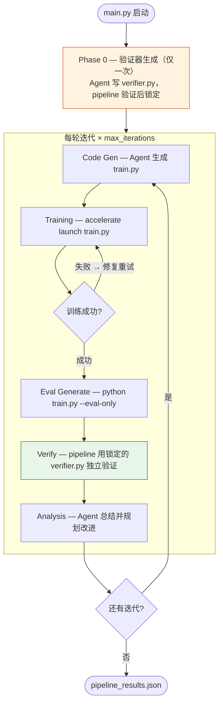

# OpenCode RL

使用 OpenCode 进行 RL 后训练的自动化 Pipeline，包含两阶段分离验证（anti-reward-hacking）和断点续跑支持。

## 功能

- **两阶段分离验证**：Agent 写 verifier.py（Phase 0 锁定），pipeline 独立验证，防止 reward 注水
- **状态机 + 断点续跑**：每阶段完成后自动 checkpoint，`--resume` 从中断处继续
- **自动数据下载**：benchmark 数据从 HuggingFace 自动下载，首次运行即用
- 固定阶段式 Pipeline：验证器生成 → 代码生成 → 训练 → 评测 → 独立验证 → 分析
- Benchmark 注册表：自动发现 `benchmarks/` 下的所有 benchmark
- 运行隔离：每次运行产物存放在 `runs/{benchmark}_{timestamp}/`

## 安装

```bash
python3 -m venv .venv
source .venv/bin/activate
pip install -r requirements.txt
```

## 快速开始

### 1. 配置 LLM API

在运行脚本中设置三个环境变量：

```bash
export OPENAI_API_KEY="sk-1234"
export OPENAI_API_BASE="http://your-llm-server:port"
export OPENCODE_MODEL="gpt-5.2"
```

### 2. 运行

```bash
# 使用预配置脚本（推荐）
bash run_humaneval.sh
bash run_mbpp.sh

# 或直接运行
python main.py --benchmark humaneval --base-model Qwen/Qwen2.5-0.5B-Instruct

# 指定 GPU
CUDA_VISIBLE_DEVICES=0,1 bash run_mbpp.sh
```

数据不存在时会自动从 HuggingFace 下载，无需手动准备。

### 3. 查看结果

运行结束后查看 `runs/{benchmark}_{timestamp}/pipeline_results.json`。

## Benchmark 管理

### 查看可用 benchmark

```bash
python main.py --list-benchmarks
```

### 下载数据

```bash
# 下载全部 benchmark 数据
python benchmarks/download.py

# 下载指定的
python benchmarks/download.py humaneval

# 强制重新下载
python benchmarks/download.py --force

# 查看下载状态
python benchmarks/download.py --list
```

数据下载到 `benchmarks/{name}/data/train.jsonl`，已被 `.gitignore` 排除。

### 已有 benchmark

| 名称 | 类型 | 数据来源 | 条数 |
|------|------|----------|------|
| gsm8k | math | `openai/gsm8k` | 100 |
| humaneval | code | `openai/openai_humaneval` | 164 |
| mbpp | code | `google-research-datasets/mbpp` | 50 |

### 新增 Benchmark

**第一步：创建目录和配置**

```bash
mkdir -p benchmarks/my_benchmark
```

创建 `benchmarks/my_benchmark/config.yaml`：

```yaml
name: my_benchmark
task_type: code              # code 或 math
description: "一句话描述"
source:                      # 有这个字段就能自动下载
  hf_dataset: org/dataset    # HuggingFace 数据集名
  hf_split: test             # 使用哪个 split
  max_samples: 200           # 0 = 全量
```

**第二步：添加转换器**（如果用自动下载）

在 `benchmarks/download.py` 的 `CONVERTERS` 字典中添加一个转换函数，将 HuggingFace 的字段映射到统一格式：

```python
def _convert_my_benchmark(row: dict) -> dict:
    return {
        "question": row["原始题目字段"],
        "answer": row["原始答案字段"],
        # code 类加上：
        "task_id": row["id"],
        "test": row["test_cases"],
    }

CONVERTERS = {
    ...
    "my_benchmark": _convert_my_benchmark,
}
```

**第三步：写 description.md**（推荐）

创建 `benchmarks/my_benchmark/description.md`，这是 Agent 编写 `train.py` 和 `verifier.py` 的唯一参考：

```markdown
# My Benchmark

## Task
描述任务是什么。

## Data Format
每条数据的字段含义：
- `question`: ...
- `answer`: ...
- `test`: ...

## Evaluation
如何判断正确：
- 对于 code 类：拼接生成代码 + test，exec() 无异常即为正确
- 对于 math 类：提取最终数字，与 answer 中 #### 后的数字比对
```

**第四步：运行**

```bash
python main.py --benchmark my_benchmark
# 数据自动下载 → Phase 0 生成 verifier → 开始迭代
```

**也可以不用自动下载**，手动放一个 `data/train.jsonl` 即可，每行格式：

```json
{"question": "题目", "answer": "正确答案", ...}
```

### Benchmark 目录结构

```
benchmarks/my_benchmark/
├── config.yaml          ← 必须：名称、类型、数据源
├── description.md       ← 推荐：Agent 的任务说明
└── data/
    └── train.jsonl      ← 自动下载或手动放置
```

## Pipeline 执行流程



## 命令行参数

```bash
python main.py \
    --benchmark {name}              # benchmark 名称（默认 gsm8k）
    --base-model {model}            # 基础模型路径（默认 Qwen/Qwen2.5-0.5B-Instruct）
    --max-iterations {n}            # 最大迭代次数（默认 5）
    --max-fix-retries {n}           # 训练失败最大修复次数（默认 20）
    --max-eval-repair-retries {n}   # 评测零分最大修复次数（默认 2）
    --training-timeout {seconds}    # 训练超时（默认 3600）
    --stale-timeout {seconds}       # LLM 无活动超时（默认 180）
    --max-verifier-retries {n}      # verifier 生成重试次数（默认 2）
    --http-timeout {seconds}        # HTTP 连接超时（默认 300）
    --resume                        # 从 checkpoint 断点续跑
    --run-dir {path}                # 自定义输出目录
    --list-benchmarks               # 列出可用 benchmark
```

## 环境变量

| 变量 | 用途 |
|------|------|
| `OPENAI_API_KEY` | LLM API 密钥 |
| `OPENCODE_MODEL` | OpenCode 模型名 |
| `OPENAI_API_BASE` | LLM API 地址 |
| `CUDA_VISIBLE_DEVICES` | GPU 选择 |

## 项目结构

```
opencode-rl/
├── main.py                      # 主入口
├── run_humaneval.sh             # HumanEval 运行脚本
├── run_mbpp.sh                  # MBPP 运行脚本
│
├── benchmarks/                  # Benchmark 注册表 + 数据
│   ├── registry.py              #   自动发现
│   ├── download.py              #   数据下载脚本
│   ├── gsm8k/
│   │   ├── config.yaml
│   │   └── data/train.jsonl     #   自动下载，不入 git
│   ├── humaneval/
│   │   ├── config.yaml
│   │   ├── description.md
│   │   └── data/train.jsonl
│   ├── mbpp/
│   │   ├── config.yaml
│   │   ├── description.md
│   │   └── data/train.jsonl
│   └── _template/               #   新 benchmark 模板
│
├── pipeline/                    # Pipeline 核心
│   ├── runner.py                #   状态机主循环 + checkpoint
│   ├── phases.py                #   各阶段实现
│   ├── prompts.py               #   Agent prompt 模板
│   ├── types.py                 #   数据类型（Phase/State/Result）
│   ├── state.py                 #   checkpoint 存取
│   ├── verification.py          #   独立验证器
│   ├── ui.py                    #   终端 UI
│   ├── stream.py                #   流式输出
│   └── utils.py                 #   工具函数
│
├── runner_fsm/                  # OpenCode 客户端
│   └── opencode/
│       ├── client.py            #   OpenCode server 通信
│       ├── llm_proxy.py         #   LLM 请求代理
│       ├── tool_executor.py     #   工具执行
│       └── tool_parser.py       #   工具调用解析
│
└── runs/                        # 运行产物（自动生成）
    └── {benchmark}_{timestamp}/
        ├── code/
        │   ├── train.py         #   Agent 生成的训练代码
        │   └── verifier.py      #   锁定的验证器
        ├── output/              #   模型 checkpoint
        ├── checkpoint.json      #   pipeline 断点
        └── pipeline_results.json
```

## 结果导出到 UI

```bash
python3 export_to_ui.py              # 导入所有 runs/
python3 export_to_ui.py --dry-run    # 预览
python3 export_to_ui.py --run-dir runs/mbpp_20260226_153910  # 导入指定 run
```
